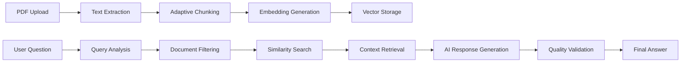

<div align="center">

# [](https://github.com/Kedhareswer/QuantumPDF_ChatApp)

</div>

<div align="center">

**AI-Powered PDF Document Analysis & Chat Platform**

[](https://www.gnu.org/licenses/gpl-3.0)
[](https://nextjs.org/)
[](https://reactjs.org/)
[](https://www.typescriptlang.org/)
[](https://tailwindcss.com/)

</div>

---

## 📖 Table of Contents

- [Overview](#-overview)
- [How It Works](#-how-it-works)
- [Key Features](#-key-features)
- [Architecture](#-architecture)
- [Use Cases](#-use-cases)
- [Getting Started](#-getting-started)
- [Configuration](#-configuration)
- [Example Prompts](#-example-prompts)
- [Performance](#-performance)
- [Contributing](#-contributing)
- [License](#-license)

---

## 🌟 Overview

QuantumPDF ChatApp enables intelligent conversations with PDF documents. Built with Next.js 15 and React 19, it uses Retrieval-Augmented Generation (RAG) to provide accurate, context-aware responses from your documents.

### What Makes It Different

- **Multi-phase RAG processing** for improved accuracy
- **20+ AI provider support** for flexibility
- **Client-side PDF processing** for privacy
- **Adaptive chunk sizing** for optimal performance
- **Document pre-filtering** for targeted searches
- **Real-time quality metrics** for transparency

---

## 🔧 How It Works

### Core Processing Flow



### Technical Components

1. **PDF Processing**
   - Uses PDF.js for text extraction
   - Supports OCR via Tesseract.js for scanned documents
   - Preserves document structure and metadata

2. **Intelligent Chunking**
   - Dynamically adjusts chunk size based on document length
   - Maintains semantic boundaries
   - Optimizes for model context windows

3. **Vector Search**
   - Generates embeddings using configured AI provider
   - Stores in vector database (Pinecone, ChromaDB, etc.)
   - Performs cosine similarity search

4. **RAG Engine**
   - Retrieves relevant document chunks
   - Applies pre-filters (author, date, tags)
   - Generates contextual responses

---

## ✨ Key Features

### Document Processing

| Feature | Description | Benefit |
|---------|-------------|---------|
| **Client-side Processing** | PDFs processed in browser | Privacy & speed |
| **Adaptive Chunking** | Dynamic chunk sizing | Better context preservation |
| **Metadata Extraction** | Author, date, title extraction | Enhanced filtering |
| **OCR Support** | Process scanned documents | Broader compatibility |

### AI Capabilities

| Provider | Models | Use Case |
|----------|--------|----------|
| **OpenAI** | GPT-4, GPT-3.5 | General purpose, high quality |
| **Anthropic** | Claude 3 | Long context, analysis |
| **Google AI** | Gemini Pro | Multimodal capabilities |
| **Groq** | Llama 3, Mixtral | Fast inference |
| **Local Models** | Via Ollama | Privacy-focused |

### Search & Retrieval

- **Semantic Search**: Find content by meaning
- **Keyword Search**: Exact text matching
- **Hybrid Search**: Best of both approaches
- **Pre-filtering**: Filter by author, date, tags, documents
- **Similarity Threshold**: Adjustable relevance scoring

---

## 🏗️ Architecture

### System Components

```
┌─────────────────┐     ┌─────────────────┐     ┌─────────────────┐
│   Frontend      │     │   API Routes    │     │   AI Services   │
│                 │     │                 │     │                 │
│ • React 19      │────▶│ • PDF Extract   │────▶│ • OpenAI        │
│ • Next.js 15    │     │ • Chat Handler  │     │ • Anthropic     │
│ • Tailwind CSS  │     │ • Vector DB     │     │ • Google AI     │
│ • Radix UI      │     │ • Search        │     │ • 20+ Providers │
└─────────────────┘     └─────────────────┘     └─────────────────┘
         │                       │                        │
         └───────────────────────┴────────────────────────┘
                                 │
                    ┌────────────▼────────────┐
                    │    Vector Database      │
                    │                         │
                    │ • Pinecone              │
                    │ • ChromaDB              │
                    │ • Weaviate              │
                    │ • Local Storage         │
                    └─────────────────────────┘
```

### Data Flow

1. **Document Upload** → PDF.js extraction → Adaptive chunking
2. **Embedding Generation** → AI provider → Vector storage
3. **User Query** → Embedding → Similarity search
4. **Context Retrieval** → Filtered chunks → AI generation
5. **Response** → Quality metrics → User interface

---

## 💡 Use Cases

### Academic Research
- **Challenge**: Analyzing multiple research papers
- **Solution**: Upload PDFs, ask comparative questions
- **Example**: "Compare the methodologies used in these papers"

### Legal Document Review
- **Challenge**: Finding specific clauses in contracts
- **Solution**: Semantic search with keyword precision
- **Example**: "Find all termination clauses with 30-day notice"

### Technical Documentation
- **Challenge**: Quick answers from extensive docs
- **Solution**: Natural language queries
- **Example**: "How do I configure authentication?"

### Business Reports
- **Challenge**: Extracting insights from reports
- **Solution**: Analytical questions with data extraction
- **Example**: "What were the Q3 revenue trends?"

---

## 🚀 Getting Started

### Prerequisites

- Node.js 18+ 
- PNPM package manager
- AI provider API key (at least one)

### Installation

```bash
# Clone repository
git clone https://github.com/Kedhareswer/QuantumPDF_ChatApp.git
cd QuantumPDF_ChatApp

# Install dependencies
pnpm install

# Configure environment
cp .env.example .env.local
# Edit .env.local with your API keys

# Start development server
pnpm dev
```

### First Steps

1. **Configure AI Provider**: Settings → AI Configuration
2. **Upload PDF**: Documents → Upload Document
3. **Start Chatting**: Ask questions about your documents

---

## ⚙️ Configuration

### Configuration Options

| Setting | Description | Default |
|---------|-------------|---------|
| **AI Provider** | LLM for chat responses | Required |
| **Embedding Model** | Model for vector generation | Provider default |
| **Vector Database** | Storage for embeddings | Local storage |
| **Chunk Size** | Text segment size | Adaptive (300-1200) |
| **Overlap** | Chunk overlap percentage | 10% |

---

## 📝 Example Prompts

### Information Extraction
```
"What are the key findings in this research paper?"
"List all the requirements mentioned in section 3"
"Extract the financial data from the annual report"
```

### Analysis & Comparison
```
"Compare the approaches described in chapters 2 and 5"
"What are the pros and cons of the proposed solution?"
"How does this contract differ from the standard template?"
```

### Specific Searches
```
"Find all mentions of 'machine learning' with their context"
"What does the document say about data privacy?"
"Show me the conclusion section"
```

### Complex Queries
```
"Summarize the methodology and results, focusing on statistical significance"
"What are the legal implications of clause 7.3 combined with section 12?"
"Based on the financial statements, calculate the year-over-year growth"
```

---

## ⚡ Performance

### Benchmarks

| Operation | Time | Notes |
|-----------|------|-------|
| PDF Processing (1MB) | ~12s | Client-side |
| Embedding Generation | ~4.5s | Depends on provider |
| Vector Search | <100ms | 1000 chunks |
| Chat Response | 2-5s | Varies by complexity |

### Optimization Features

- **Adaptive Chunking**: Reduces API calls by 30-40%
- **Pre-filtering**: Speeds up search by limiting scope
- **Client-side Processing**: No upload delays
- **Response Caching**: Faster repeated queries

---

## 🤝 Contributing

Contributions are welcome! Please see [CONTRIBUTING.md](CONTRIBUTING.md) for guidelines.

### Areas for Contribution

- Additional AI provider integrations
- Performance optimizations
- UI/UX improvements
- Documentation and examples
- Bug fixes and testing

---

## 📄 License

This project is licensed under the GNU General Public License v3.0. See [LICENSE](LICENSE) for details.

---

## 🌟 Star History

[](https://star-history.com/#Kedhareswer/QuantumPDF_ChatApp&Date)

---

<div align="center">

**Built with care by the community**

If you find this project helpful, please consider giving it a ⭐

</div>
