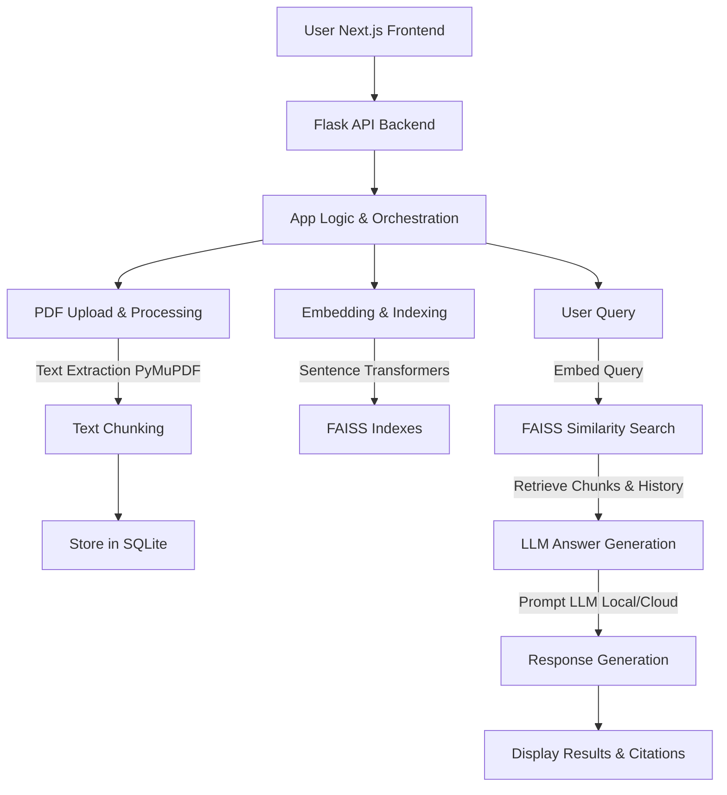

# 🌌 QuantumPDF ChatApp

<p align="center">
  
</p>

<div align="center">

[](https://github.com/Kedhareswer/QuantumPDF_ChatApp/stargazers)
[](https://github.com/Kedhareswer/QuantumPDF_ChatApp/fork)
[](LICENSE)
[](https://github.com/Kedhareswer/QuantumPDF_ChatApp/commits/main)
[](https://github.com/Kedhareswer/QuantumPDF_ChatApp/issues)
[](https://github.com/Kedhareswer/QuantumPDF_ChatApp/graphs/contributors)

</div>

---

> **QuantumPDF ChatApp** is an intelligent, open-source web application that transforms how you interact with PDF documents. Leveraging cutting-edge Large Language Models (LLMs), you can “chat” with your PDFs, ask complex questions, extract key information, and summarize content—all in a conversational interface.

Whether you’re handling dense research papers, technical manuals, or long reports, **QuantumPDF ChatApp** turns static documents into dynamic conversational partners.

<p align="center"><b>⭐️ If you find this project useful, <a href="https://github.com/Kedhareswer/QuantumPDF_ChatApp/stargazers">star it on GitHub!</a></b></p>

---

## ✨ Features

<details>
<summary>🧠 <b>Intelligent PDF Processing</b></summary>

- 📝 **Advanced Text Extraction:** High-fidelity extraction using PyMuPDF (Fitz).
- 🪓 **Smart Chunking:** Splits text into context-optimized, overlapping chunks for best LLM results.
- 🔍 **OCR Support:** Extract text from scanned documents and images within PDFs.
- 🏷️ **Metadata Extraction:** Automatically extracts document metadata and structure.
</details>

<details>
<summary>🔍 <b>Powerful Search & Retrieval</b></summary>

- **Semantic Search:** FAISS vector similarity search using Sentence Transformers.
- **Multi-Document Querying:** Upload and chat with multiple PDFs in a session.
</details>

<details>
<summary>🤖 <b>Flexible LLM Integration</b></summary>

- **Local Models:** Run Hugging Face models (e.g., DialoGPT, Zephyr, Mistral) on your hardware.
- **Cloud APIs:** Integrate with OpenAI, Google Gemini, or AIML APIs.
</details>

<details>
<summary>💬 <b>Engaging User Experience</b></summary>

- **Interactive Chat:** Next.js + React frontend for seamless conversations.
- **Source Citations:** Answers reference specific PDF chunks.
- **Document Management:** Upload, view, or remove PDFs per session.
- **Conversation History:** Context-aware responses by remembering previous turns.
- **Dark/Light Modes:** Choose your favorite theme.
</details>

<details>
<summary>🛠️ <b>Robust & Developer-Friendly</b></summary>

- **Persistent Storage:** SQLite for document metadata and text.
- **Session Management:** Organized uploads and chats by session.
- **Configurable & Extensible:** Easily add models, adjust embedding models, or swap vector DBs.
- **Health Check Endpoint:** `/health` API for monitoring.
- **Responsive Design:** Optimized for desktop and tablet.
</details>

<details>
<summary>🏗️ <b>Codebase Structure Overview</b></summary>

- **Frontend (Next.js/React):** Located primarily in `app/` (pages and Next.js API routes), `components/` (React components), and `lib/` (frontend utilities). The UI allows users to upload PDFs and interact with the chat interface.
- **Backend (Python/Flask):** The core RAG pipeline and application logic reside in `app.py`. This includes PDF text extraction (using PyMuPDF), chunking, embedding generation (with Sentence Transformers), FAISS indexing, and LLM interaction. It serves API endpoints consumed by the frontend.
- **PDF Processing Flow:**
    - The Next.js frontend captures PDF uploads and sends them to the Flask backend (`/upload` endpoint in `app.py`).
    - All significant PDF processing (extraction, chunking, embedding, indexing) occurs on this Python backend.
- **Embedding Service (`ragoon_service/`):** This directory contains a separate FastAPI application designed as a general-purpose embedding service. *Note: This service is not currently integrated into the main QuantumPDF ChatApp's RAG pipeline, which handles its embeddings directly within `app.py`.*
- **Configuration:** Key configurations for API keys are in `.env`. Model choices for LLMs are managed within `app.py` and accessible via the `/models` API.
</details>

<details>
<summary>📊 <b>Experimentation & Observability</b></summary>

- **Weights & Biases:** Track experiments and model performance (WandB).
- **Comprehensive Logging:** For debugging and monitoring.
</details>

---

## ⚙️ How QuantumPDF ChatApp Works

QuantumPDF ChatApp uses a **Retrieval Augmented Generation (RAG)** pipeline, combining semantic search and LLMs to answer your queries:

- 📝 **Advanced Text Extraction:** High-fidelity extraction using PyMuPDF (Fitz).
- 🪓 **Smart Chunking:** Splits text into context-optimized, overlapping chunks for best LLM results.
</details>

<details>
<summary>🔍 <b>Powerful Search & Retrieval</b></summary>

- **Semantic Search:** FAISS vector similarity search using Sentence Transformers.
- **Multi-Document Querying:** Upload and chat with multiple PDFs in a session.
</details>

<details>
<summary>🤖 <b>Flexible LLM Integration</b></summary>

- **Local Models:** Run Hugging Face models (e.g., DialoGPT, Zephyr, Mistral) on your hardware.
- **Cloud APIs:** Integrate with OpenAI, Google Gemini, or AIML APIs.
</details>

<details>
<summary>💬 <b>Engaging User Experience</b></summary>

- **Interactive Chat:** Next.js + React frontend for seamless conversations.
- **Source Citations:** Answers reference specific PDF chunks.
- **Document Management:** Upload, view, or remove PDFs per session.
- **Conversation History:** Context-aware responses by remembering previous turns.
- **Dark/Light Modes:** Choose your favorite theme.
</details>

<details>
<summary>🛠️ <b>Robust & Developer-Friendly</b></summary>

- **Persistent Storage:** SQLite for document metadata and text.
- **Session Management:** Organized uploads and chats by session.
- **Configurable & Extensible:** Easily add models, adjust embedding models, or swap vector DBs.
- **Health Check Endpoint:** `/health` API for monitoring.
- **Responsive Design:** Optimized for desktop and tablet.
</details>

<details>
<summary>🏗️ <b>Codebase Structure Overview</b></summary>

- **Frontend (Next.js/React):** Located primarily in `app/` (pages and Next.js API routes), `components/` (React components), and `lib/` (frontend utilities). The UI allows users to upload PDFs and interact with the chat interface.
- **Backend (Python/Flask):** The core RAG pipeline and application logic reside in `app.py`. This includes PDF text extraction (using PyMuPDF), chunking, embedding generation (with Sentence Transformers), FAISS indexing, and LLM interaction. It serves API endpoints consumed by the frontend.
- **PDF Processing Flow:**
    - The Next.js frontend captures PDF uploads and sends them to the Flask backend (`/upload` endpoint in `app.py`).
    - All significant PDF processing (extraction, chunking, embedding, indexing) occurs on this Python backend.
- **Embedding Service (`ragoon_service/`):** This directory contains a separate FastAPI application designed as a general-purpose embedding service. *Note: This service is not currently integrated into the main QuantumPDF ChatApp's RAG pipeline, which handles its embeddings directly within `app.py`.*
- **Configuration:** Key configurations for API keys are in `.env`. Model choices for LLMs are managed within `app.py` and accessible via the `/models` API.
</details>

<details>
<summary>📊 <b>Experimentation & Observability</b></summary>

- **Weights & Biases:** Track experiments and model performance (WandB).
- **Comprehensive Logging:** For debugging and monitoring.
</details>

---

## ⚙️ How QuantumPDF ChatApp Works

QuantumPDF ChatApp uses a **Retrieval Augmented Generation (RAG)** pipeline, combining semantic search and LLMs to answer your queries:



<details>
<summary><b>Step-by-Step Pipeline</b></summary>


<details>
<summary><b>Step-by-Step Pipeline</b></summary>

1. **Session Start:** User accesses the web UI, starting a new session.
2. **Document Upload:** Upload PDFs. Backend extracts text (PyMuPDF), chunks and stores it in SQLite.
3. **Embedding & Indexing:** Text chunks → embeddings (Sentence Transformers) → FAISS index for similarity search.
4. **Query & Retrieval:** User query is embedded & searched against FAISS index for the most relevant text.
5. **Answer Generation:** Retrieved chunks + conversation history = context for selected LLM (local/cloud).
6. **Display:** Frontend shows the answer, highlighting the cited PDF chunks.
</details>

---

## 🚀 Key Benefits

- **Ask complex questions directly to your PDFs.**
- **Get answers with cited evidence from your documents.**
- **Support for both local (privacy-first) and cloud-based models.**
- **Effortlessly manage and search across multiple PDFs in one session.**
- **Easy to extend for your own research or business use-cases.**

---

## 📦 Installation

### Prerequisites

- Python ≥ 3.8
- Node.js ≥ 16 (for Next.js frontend)
- `pip`, `git`

### Quickstart

```bash
# 1. Clone the repository
git clone https://github.com/Kedhareswer/QuantumPDF_ChatApp.git
cd QuantumPDF_ChatApp

# 2. Setup Environment Variables
cp .env.example .env
# Edit your .env file with your API keys:
# OPENAI_API_KEY=...
# GEMINI_API_KEY=...
# AIML_API_KEY=...

# 3. Backend Setup (Python)
python -m venv venv
source venv/bin/activate  # On Windows: .\venv\Scripts\activate
pip install -r requirements.txt

# 4. Frontend Setup (Next.js)
npm install        # or: pnpm install

# 5. Run the App
# In one terminal (backend):
python app.py
# In another terminal (frontend):
npm run dev        # or: pnpm run dev

# 6. Open http://localhost:3000 in your browser.
```

---

## ▶️ Usage

1. **Open the Web Interface:**  
   Go to [http://localhost:3000](http://localhost:3000).

2. **Upload PDFs:**  
   Use the "Upload PDF" button or drag-and-drop.

3. **Select LLM Model:**  
   - Choose a local or cloud-based LLM (OpenAI, Gemini, etc.).
   - Ensure API keys are set in your `.env` or the UI.

4. **Ask Questions:**  
   Type questions about your PDFs in chat.

5. **Review Answers & Sources:**  
   Answers include PDF citations.

6. **Manage Documents:**  
   Add/remove PDFs, clear chat as needed.

**Sample Questions:**
- “What is the main finding of [paper.pdf]?”
- “Summarize section 2 of [manual.pdf].”
- “Compare methodologies in [A.pdf] and [B.pdf].”

---

## 🛠️ Configuration

- **Environment Variables:**  
  Set API keys in `.env`:
  ```env
  OPENAI_API_KEY=your_openai_key
  GEMINI_API_KEY=your_gemini_key
  AIML_API_KEY=your_aiml_key
  WANDB_API_KEY=your_wandb_key
  ```

- **Model Selection:**  
  - Add/change models in `app.py` (see `/models` endpoint and `MultiDocumentRAG`).

- **Text Chunking:**  
  - Defaults: `chunk_size ≈ 500 tokens`, `overlap ≈ 50 tokens` in `chunk_text` (backend).

- **Conversation Memory:**  
  - `ConversationMemory` in `app.py` keeps the last 10 chat turns.

- **Storage:**
  - **FAISS:** In-memory, rebuilt on restart/session change.
  - **SQLite:** Persistent document/text storage in `documents.db`.

- **Switching Vector DBs:**  
  Want Pinecone, Weaviate, etc.? Update storage/retrieval logic to replace FAISS.

---

## ⚡ Performance Tips

- **RAM:** Minimum 8GB, 16GB+ recommended for local LLMs.
- **GPU:** CUDA-enabled GPU + PyTorch = much faster local LLM processing.
- **Accuracy:** Larger embedding models boost results (at cost of RAM/CPU). Enable caching for repeated queries.

---

## 🆘 Troubleshooting

- **PDF Errors:**  
    - Avoid very large or image-only (scanned) PDFs.
- **Model Issues:**  
    - Watch RAM if using local LLMs.
    - Ensure stable internet for cloud LLMs.
- **API Issues:**  
    - Double-check API keys, permissions, and rate limits.
- **Logs:**  
    - Check both Flask (backend) and Next.js (frontend) terminals for error details.

> Persistent issues? [Open an Issue!](https://github.com/Kedhareswer/QuantumPDF_ChatApp/issues) Please include logs and steps to reproduce.

---

## ➕ Extending

- **Add New Models:**  
  Update `app.py` (`/models` endpoint and `MultiDocumentRAG`), plus frontend model select UI.
- **Custom Embeddings:**  
  Swap the default embedding model (`sentence-transformers/all-MiniLM-L6-v2`) in backend code.
- **Persistent Vector DB:**  
  Swap FAISS for Pinecone, Weaviate, ChromaDB, etc. by updating storage logic.

---

## 📜 License

[GNU GPL v3.0](LICENSE)

---

## 🤝 Community & Support

- [GitHub Discussions](https://github.com/Kedhareswer/QuantumPDF_ChatApp/discussions)
- [Issues](https://github.com/Kedhareswer/QuantumPDF_ChatApp/issues)

---

<p align="center">
  
</p>
