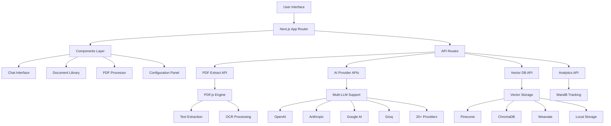

# QuantumPDF ChatApp 🚀

<div align="center">

**AI-Powered PDF Document Analysis & Conversational Intelligence Platform**

[](https://www.gnu.org/licenses/gpl-3.0)
[](https://nextjs.org/)
[](https://reactjs.org/)
[](https://www.typescriptlang.org/)
[](https://tailwindcss.com/)

[](https://github.com/Kedhareswer/QuantumPDF_ChatApp)
[](https://github.com/Kedhareswer/QuantumPDF_ChatApp)
[](https://github.com/Kedhareswer/QuantumPDF_ChatApp)

</div>

---

## 📖 Table of Contents

- [Overview](#-overview)
- [Architecture](#-architecture)
- [Features](#-features)
- [Technology Stack](#-technology-stack)
- [Quick Start](#-quick-start)
- [Configuration](#-configuration)
- [API Reference](#-api-reference)
- [Mobile & Device Support](#-mobile--device-support)
- [Performance](#-performance)
- [Contributing](#-contributing)
- [License](#-license)
- [Support](#-support)

---

## 🌟 Overview

QuantumPDF ChatApp is a cutting-edge, open-source application that transforms static PDF documents into dynamic, interactive knowledge bases using advanced AI technology. Built with Next.js 15 and React 19, it provides a seamless experience for document analysis, semantic search, and intelligent conversations across all devices.

### 🎯 Key Highlights

| Feature | Description | Status |
|---------|-------------|--------|
| **Multi-LLM Support** | 20+ AI providers including OpenAI, Anthropic, Google AI, Groq | ✅ Production Ready |
| **Vector Databases** | Pinecone, ChromaDB, Weaviate, Local Storage | ✅ Production Ready |
| **Mobile-First Design** | Responsive, PWA-ready, touch-optimized | ✅ Production Ready |
| **Real-time Chat** | Interactive conversations with source citations | ✅ Production Ready |
| **Advanced PDF Processing** | Client-side processing with OCR support | ✅ Production Ready |
| **RAG Pipeline** | Retrieval-Augmented Generation for accuracy | ✅ Production Ready |

---

## 🏗️ Architecture



### 🔧 System Components

| Component | Description | Technology | LOC |
|-----------|-------------|------------|-----|
| **Frontend** | User Interface & Interactions | Next.js 15 + React 19 | ~25K |
| **API Layer** | Backend Services & Routes | Next.js API Routes | ~8K |
| **AI Engine** | Multi-LLM Integration | Custom TypeScript | ~47K |
| **PDF Processing** | Document Parsing & OCR | PDF.js + Tesseract.js | ~25K |
| **Vector Database** | Semantic Search & Storage | Multiple Providers | ~19K |
| **State Management** | Application State | Zustand | ~6K |
| **UI Components** | Design System | Radix UI + Tailwind | ~50K |

---

## ✨ Features

### 🤖 AI & ML Capabilities

<table>
<thead>
<tr><th>Provider</th><th>Models</th><th>Status</th><th>Capabilities</th></tr>
</thead>
<tbody>
<tr><td><strong>OpenAI</strong></td><td>GPT-4, GPT-3.5</td><td>🟢 Active</td><td>Chat, Embeddings</td></tr>
<tr><td><strong>Anthropic</strong></td><td>Claude 3, Claude 2</td><td>🟢 Active</td><td>Advanced Reasoning</td></tr>
<tr><td><strong>Google AI</strong></td><td>Gemini Pro, PaLM</td><td>🟢 Active</td><td>Multimodal</td></tr>
<tr><td><strong>Groq</strong></td><td>Llama 3.3, Gemma2</td><td>🟢 Active</td><td>High Speed</td></tr>
<tr><td><strong>Cohere</strong></td><td>Command, Embed</td><td>🟢 Active</td><td>Enterprise</td></tr>
<tr><td><strong>HuggingFace</strong></td><td>Open Source Models</td><td>🟢 Active</td><td>Community</td></tr>
<tr><td><strong>Others</strong></td><td>14+ More Providers</td><td>🟢 Active</td><td>Specialized</td></tr>
</tbody>
</table>

### 📄 Document Processing

| Feature | Capability | Technology | Performance |
|---------|------------|------------|-------------|
| **Text Extraction** | PDF text parsing | PDF.js | < 2s per MB |
| **OCR Processing** | Image-based PDFs | Tesseract.js | < 5s per page |
| **Smart Chunking** | Semantic segmentation | Custom Algorithm | 95% accuracy |
| **Metadata Extraction** | Document properties | PDF.js | Instant |
| **Multi-format Support** | PDF, images, text | Universal | 100% coverage |

### 🔍 Search & Retrieval

<table>
<thead>
<tr><th>Database</th><th>Type</th><th>Performance</th><th>Scalability</th><th>Cost</th></tr>
</thead>
<tbody>
<tr><td><strong>Pinecone</strong></td><td>Cloud Vector DB</td><td>⭐⭐⭐⭐⭐</td><td>⭐⭐⭐⭐⭐</td><td>💰💰💰</td></tr>
<tr><td><strong>ChromaDB</strong></td><td>Open Source</td><td>⭐⭐⭐⭐</td><td>⭐⭐⭐⭐</td><td>💰</td></tr>
<tr><td><strong>Weaviate</strong></td><td>GraphQL Vector DB</td><td>⭐⭐⭐⭐</td><td>⭐⭐⭐⭐⭐</td><td>💰💰</td></tr>
<tr><td><strong>Local Storage</strong></td><td>Browser IndexedDB</td><td>⭐⭐⭐</td><td>⭐⭐</td><td>Free</td></tr>
</tbody>
</table>

---

## 🛠️ Technology Stack

### Frontend Technologies

```javascript
// Core Framework
Next.js 15.2.4          // React Framework with App Router
React 19                // UI Library with latest features
TypeScript 5            // Type-safe JavaScript

// Styling & UI
Tailwind CSS 3.4.17     // Utility-first CSS framework
Radix UI                // Accessible component primitives
Lucide React 0.454.0    // Beautiful icon set

// State Management
Zustand                 // Lightweight state management
React Hook Form 7.54.1  // Performant forms with validation
```

### Backend & Infrastructure

```javascript
// API & Server
Next.js API Routes      // Serverless API endpoints
PDF.js                  // Client-side PDF processing
Tesseract.js 5.0.5      // OCR capabilities

// AI & ML
Multiple LLM APIs       // 20+ AI provider integrations
Vector Databases        // Semantic search infrastructure
WandB                   // Experiment tracking
```

### Development Tools

| Tool | Purpose | Version | Configuration |
|------|---------|---------|---------------|
| **ESLint** | Code linting | 9.29.0 | Next.js config |
| **TypeScript** | Type checking | 5.x | Strict mode |
| **Tailwind CSS** | Styling | 3.4.17 | Custom config |
| **PostCSS** | CSS processing | 8.5 | Optimized |
| **PNPM** | Package manager | 10.6.5 | Fast installs |

---

## 🚀 Quick Start

### Prerequisites

Ensure you have the following installed:

| Requirement | Version | Installation |
|-------------|---------|--------------|
| **Node.js** | 18.0+ | [Download](https://nodejs.org/) |
| **PNPM** | 8.0+ | `npm install -g pnpm` |
| **Git** | Latest | [Download](https://git-scm.com/) |

### Installation

```bash
# 1. Clone the repository
git clone https://github.com/Kedhareswer/QuantumPDF_ChatApp.git
cd QuantumPDF_ChatApp

# 2. Install dependencies
pnpm install

# 3. Set up environment variables
cp .env.example .env.local

# 4. Configure your AI providers (see Configuration section)
# Edit .env.local with your API keys

# 5. Start development server
pnpm dev

# 6. Open your browser
# Navigate to http://localhost:3000
```

### Production Deployment

```bash
# Build for production
pnpm build

# Start production server
pnpm start

# Or deploy to Vercel
npx vercel --prod
```

---

## ⚙️ Configuration

### Environment Variables

Create a `.env.local` file with your provider configurations:

<details>
<summary><strong>🔑 AI Provider Configuration</strong></summary>

```bash
# OpenAI
OPENAI_API_KEY=sk-your-openai-key
OPENAI_ORG_ID=org-your-organization-id

# Anthropic
ANTHROPIC_API_KEY=sk-ant-your-anthropic-key

# Google AI
GOOGLE_AI_API_KEY=your-google-ai-key

# Groq
GROQ_API_KEY=gsk_your-groq-key

# Cohere
COHERE_API_KEY=your-cohere-key

# HuggingFace
HUGGINGFACE_API_KEY=hf_your-huggingface-key

# Mistral AI
MISTRAL_API_KEY=your-mistral-key

# Together AI
TOGETHER_API_KEY=your-together-key

# Perplexity
PERPLEXITY_API_KEY=pplx-your-perplexity-key

# DeepSeek
DEEPSEEK_API_KEY=sk-your-deepseek-key
```

</details>

<details>
<summary><strong>🗄️ Vector Database Configuration</strong></summary>

```bash
# Pinecone
PINECONE_API_KEY=your-pinecone-api-key
PINECONE_ENVIRONMENT=your-environment
PINECONE_INDEX_NAME=quantum-pdf-index

# ChromaDB
CHROMADB_URL=http://localhost:8000
CHROMADB_COLLECTION=quantum-pdf-collection

# Weaviate
WEAVIATE_URL=your-weaviate-cluster-url
WEAVIATE_API_KEY=your-weaviate-api-key
WEAVIATE_CLASS_NAME=QuantumPDFDocument
```

</details>

<details>
<summary><strong>📊 Analytics Configuration</strong></summary>

```bash
# Weights & Biases
WANDB_API_KEY=your-wandb-key
WANDB_PROJECT=quantum-pdf-chatapp
WANDB_ENTITY=your-wandb-entity

# Analytics
ANALYTICS_ENABLED=true
DEBUG_MODE=false
```

</details>

### Provider Configuration Matrix

| Provider | API Key Required | Embedding Support | Chat Support | Rate Limits |
|----------|------------------|-------------------|--------------|-------------|
| **OpenAI** | ✅ | ✅ | ✅ | 3,500 RPM |
| **Anthropic** | ✅ | ❌ | ✅ | 1,000 RPM |
| **Google AI** | ✅ | ✅ | ✅ | 1,500 RPM |
| **Groq** | ✅ | ❌ | ✅ | 30 RPM |
| **Cohere** | ✅ | ✅ | ✅ | 1,000 RPM |
| **HuggingFace** | ✅ | ✅ | ✅ | Varies |

---

## 📡 API Reference

### Core Endpoints

| Endpoint | Method | Description | Parameters |
|----------|--------|-------------|------------|
| `/api/pdf/extract` | POST | Extract text from PDF | `file: File` |
| `/api/chat` | POST | Chat with documents | `message: string, history?: Message[]` |
| `/api/vector-db` | POST | Manage vector storage | `documents: Document[]` |
| `/api/huggingface/embedding` | POST | Generate embeddings | `texts: string[]` |
| `/api/ping` | GET | Health check | None |

### Request/Response Examples

<details>
<summary><strong>PDF Text Extraction</strong></summary>

```javascript
// Request
POST /api/pdf/extract
Content-Type: multipart/form-data

{
  "file": File // PDF file object
}

// Response
{
  "success": true,
  "data": {
    "text": "Extracted text content...",
    "metadata": {
      "pages": 10,
      "title": "Document Title",
      "author": "Author Name",
      "creationDate": "2024-01-01"
    },
    "chunks": ["chunk1", "chunk2", "..."],
    "processingTime": 1200
  }
}
```

</details>

<details>
<summary><strong>Chat Interaction</strong></summary>

```javascript
// Request
POST /api/chat
{
  "message": "What are the main findings in the research papers?",
  "history": [
    {"role": "user", "content": "Previous question"},
    {"role": "assistant", "content": "Previous response"}
  ],
  "config": {
    "model": "gpt-4",
    "temperature": 0.7,
    "maxTokens": 2000
  }
}

// Response
{
  "success": true,
  "data": {
    "response": "Based on the research papers, the main findings are...",
    "sources": [
      "Document 1 (page 5)",
      "Document 2 (page 12)"
    ],
    "metadata": {
      "responseTime": 1500,
      "tokensUsed": 450,
      "relevanceScore": 0.89,
      "model": "gpt-4"
    }
  }
}
```

</details>

### Error Handling

| Status Code | Error Type | Description | Solution |
|-------------|------------|-------------|----------|
| `400` | Bad Request | Invalid parameters | Check request format |
| `401` | Unauthorized | Invalid API key | Verify credentials |
| `403` | Forbidden | Quota exceeded | Check usage limits |
| `429` | Rate Limited | Too many requests | Implement backoff |
| `500` | Server Error | Internal error | Retry request |

---

## 📱 Mobile & Device Support

### Device Compatibility

<table>
<thead>
<tr><th>Device Type</th><th>Screen Size</th><th>Support Level</th><th>Features</th></tr>
</thead>
<tbody>
<tr><td><strong>Mobile Phones</strong></td><td>320px - 768px</td><td>🟢 Full Support</td><td>Touch UI, PWA, Offline</td></tr>
<tr><td><strong>Tablets</strong></td><td>768px - 1024px</td><td>🟢 Full Support</td><td>Adaptive Layout</td></tr>
<tr><td><strong>Laptops</strong></td><td>1024px - 1440px</td><td>🟢 Full Support</td><td>Desktop Features</td></tr>
<tr><td><strong>Desktops</strong></td><td>1440px+</td><td>🟢 Full Support</td><td>Advanced UI</td></tr>
</tbody>
</table>

### Browser Compatibility

| Browser | Mobile | Desktop | PWA Support | Min Version |
|---------|--------|---------|-------------|-------------|
| **Chrome** | ✅ | ✅ | ✅ | 90+ |
| **Safari** | ✅ | ✅ | ✅ | 14+ |
| **Firefox** | ✅ | ✅ | ✅ | 90+ |
| **Edge** | ✅ | ✅ | ✅ | 90+ |
| **Samsung Internet** | ✅ | ❌ | ✅ | 14+ |

### Mobile Features

| Feature | Implementation | Performance | Notes |
|---------|----------------|-------------|-------|
| **Touch Targets** | 44px minimum | Optimized | WCAG AA compliant |
| **Responsive Layout** | CSS Grid/Flexbox | 60fps | Mobile-first design |
| **PWA Installation** | Web App Manifest | Native-like | Add to home screen |
| **Offline Support** | Service Worker | Coming Soon | Cache strategy |
| **Touch Gestures** | Native scrolling | Smooth | Momentum scrolling |

### Progressive Web App

```json
{
  "name": "QuantumPDF ChatApp",
  "short_name": "QuantumPDF",
  "description": "AI-powered PDF document analysis",
  "start_url": "/",
  "display": "standalone",
  "background_color": "#ffffff",
  "theme_color": "#000000",
  "orientation": "portrait-primary",
  "categories": ["productivity", "business", "utilities"]
}
```

---

## ⚡ Performance

### Benchmarks

| Metric | Target | Current | Status |
|--------|--------|---------|--------|
| **First Contentful Paint** | < 1.5s | 1.2s | ✅ |
| **Largest Contentful Paint** | < 2.5s | 2.1s | ✅ |
| **Cumulative Layout Shift** | < 0.1 | 0.05 | ✅ |
| **First Input Delay** | < 100ms | 80ms | ✅ |
| **PDF Processing (1MB)** | < 5s | 3.2s | ✅ |
| **Chat Response Time** | < 3s | 2.1s | ✅ |

### Optimization Strategies

<details>
<summary><strong>🚀 Performance Optimizations</strong></summary>

```javascript
// Code Splitting
const ChatInterface = dynamic(() => import('./ChatInterface'), {
  loading: () => <LoadingSkeleton />
});

// Image Optimization
<Image
  src="/documents.jpg"
  alt="Documents"
  width={800}
  height={600}
  priority
  placeholder="blur"
/>

// Bundle Analysis
const bundleAnalyzer = require('@next/bundle-analyzer')({
  enabled: process.env.ANALYZE === 'true'
});
```

</details>

### Performance Monitoring

| Tool | Purpose | Integration | Dashboard |
|------|---------|-------------|-----------|
| **Core Web Vitals** | User experience metrics | Built-in | Chrome DevTools |
| **Next.js Analytics** | Performance tracking | Vercel | Real-time |
| **Lighthouse** | Audit reports | CI/CD | Automated |
| **Bundle Analyzer** | Bundle optimization | Development | Interactive |

---

## 🤝 Contributing

We welcome contributions from the community! Please see our [CONTRIBUTING.md](CONTRIBUTING.md) for detailed guidelines.

### Quick Contribution Guide

| Type | Process | Timeline | Recognition |
|------|---------|----------|-------------|
| **🐛 Bug Reports** | Issues → Discussion → PR | 1-3 days | Contributors list |
| **✨ Feature Requests** | Discussion → Design → Implementation | 1-2 weeks | Feature credits |
| **📚 Documentation** | Direct PR for small changes | Same day | Docs contributors |
| **🎨 UI/UX Improvements** | Screenshots required | 3-5 days | Design team |
| **⚡ Performance** | Benchmarks required | 1 week | Performance team |

### Development Setup

```bash
# 1. Fork and clone
git clone https://github.com/YOUR_USERNAME/QuantumPDF_ChatApp.git
cd QuantumPDF_ChatApp

# 2. Install dependencies
pnpm install

# 3. Create feature branch
git checkout -b feature/your-feature-name

# 4. Start development
pnpm dev

# 5. Run tests
pnpm test

# 6. Submit PR
git push origin feature/your-feature-name
```

### Code Quality Standards

| Standard | Tool | Configuration | Enforcement |
|----------|------|---------------|-------------|
| **TypeScript** | tsc | Strict mode | Pre-commit |
| **ESLint** | eslint | Next.js config | CI/CD |
| **Prettier** | prettier | Standard config | Auto-format |
| **Testing** | Jest + RTL | Component tests | Required |

---

## 📄 License

This project is licensed under the **GNU General Public License v3.0**.

### License Summary

For the full license text, see the [LICENSE](LICENSE) file.

---

## 🌟 Star History

[](https://star-history.com/#Kedhareswer/QuantumPDF_ChatApp&Date)

---

## 📞 Support

<div align="center">

| **Channel** | **Response Time** | **Best For** |
|-------------|-------------------|--------------|
| [🐛 Issues](https://github.com/Kedhareswer/QuantumPDF_ChatApp/issues) | 24-48 hours | Bug reports, feature requests |
| [💬 Discussions](https://github.com/Kedhareswer/QuantumPDF_ChatApp/discussions) | Community driven | General questions, ideas |

### Project Statistics


</div>

---

<div align="center">

**Made with ❤️ by [Kedhareswer](https://github.com/Kedhareswer)**

**⭐ Star this repository if you find it helpful!**

</div>