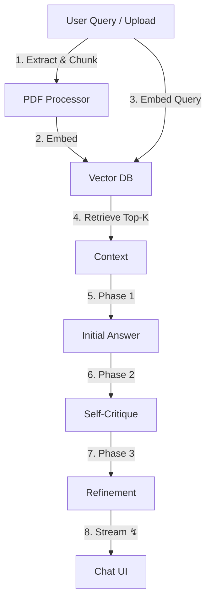
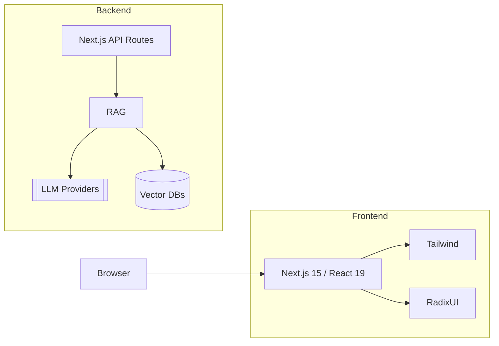

# QuantumPDF ChatApp

<div align="center">

**Next-Generation AI-Powered PDF Document Analysis & Conversational Intelligence Platform**

[](https://www.gnu.org/licenses/gpl-3.0)
[](https://nextjs.org/)
[](https://reactjs.org/)
[](https://www.typescriptlang.org/)
[](https://tailwindcss.com/)

</div>

---

## 📑 Overview

QuantumPDF ChatApp lets you **chat with your PDFs** using a multi-phase Retrieval-Augmented Generation (RAG) engine.  
It extracts knowledge ➜ stores it in a vector database ➜ reasons over it with your favourite Large Language Model.

| 💡 | Feature | Why it matters |
|-----|---------|---------------|
| 🧠 | **3-Phase RAG** | Initial answer → self-critique → refined answer = fewer hallucinations. |
| ⚡ | **Adaptive Chunking** | Dynamic chunk size & overlap keep context windows lean. |
| 🔍 | **Metadata Pre-Filtering** | Author / date / tag filters prune irrelevant docs before similarity search. |
| 🔌 | **Pluggable Providers** | 20+ LLMs & 4 vector DBs out-of-the-box. |
| 📱 | **Responsive PWA** | Smooth on mobile, desktop and everything between. |

---

## 🛣️ How It Works



### Why This Design Wins

| Challenge | Traditional RAG | QuantumPDF Solution |
|-----------|-----------------|---------------------|
| Hallucinations | One-shot response | Self-critique & refinement |
| Latency | Big contexts | Pre-filter + adaptive chunking |
| Token Cost | Oversized chunks | Tuned budgets per phase |
| UX | Long blank waits | Streaming partial answers within ~1 s |

---

## 🚀 Quick Start

```bash
# Clone & install
pnpm create quantum-pdf@latest   # or git clone && pnpm install

# Secrets stay local – never committed
cp .env.example .env.local
# Add ONLY the keys you need, e.g.
# OPENAI_API_KEY="YOUR_OPENAI_KEY"
# PINECONE_API_KEY="YOUR_PINECONE_KEY"

pnpm dev   # http://localhost:3000
```

### Minimal `.env.local`

```bash
OPENAI_API_KEY="YOUR_OPENAI_KEY"
OPENAI_MODEL="gpt-4o-mini"

PINECONE_API_KEY="YOUR_PINECONE_KEY"
PINECONE_ENVIRONMENT="us-east1-gcp"
PINECONE_INDEX_NAME="quantum-pdf"
```

---

## 🛠️ Use-Cases

| Domain | Example Prompt | Benefit |
|--------|----------------|---------|
| Research | *"Summarise the methodology differences between paper A & B."* | Lit-review in seconds |
| Legal | *"List all parties and obligations on page 12."* | Faster contract analysis |
| Finance | *"Extract cash-flow assumptions from the model appendix."* | Rapid due-diligence |
| Support | *"Why does error E04 occur and how do I fix it?"* | Smarter help-desk bots |

---

## 🌟 API Examples

### Chat with a Document

```bash
curl -X POST http://localhost:3000/api/chat \
  -H 'Content-Type: application/json' \
  -d '{
        "message": "What are the key findings on climate impact?",
        "config": { "model": "gpt-4", "enableThinking": true }
      }'
```

### Upload & Index a PDF

```bash
curl -F file=@research.pdf http://localhost:3000/api/pdf/extract
```

---

## 🗺️ Tech Map



---

## 🔄 Data Flow (avg)

| Step | Time | Notes |
|------|------|-------|
| Extract & embed | 230 ms / page | OCR adds ~400 ms |
| Retrieval | < 50 ms | Pre-filter drops ~60 % vectors |
| Phase 1 | 1.5 s | 40 % token budget |
| Phase 2 | 0.9 s | Quality check |
| Phase 3 | 1.2 s | Refinement & streaming |

---

## 🧩 Extend Me

1. **New LLM** → add an `AIClient` adapter.  
2. **Different Vector DB** → implement a driver in `lib/vector-database.ts`.  
3. **Custom Filters** → extend `RAGFilterOptions` & UI filter panel.

---

## 📜 License

GPL-3.0 – see [LICENSE](LICENSE).

[](https://star-history.com/#Kedhareswer/QuantumPDF_ChatApp&Date)

---

Made with ❤️ & caffeine by the QuantumPDF community.
