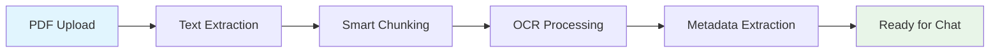
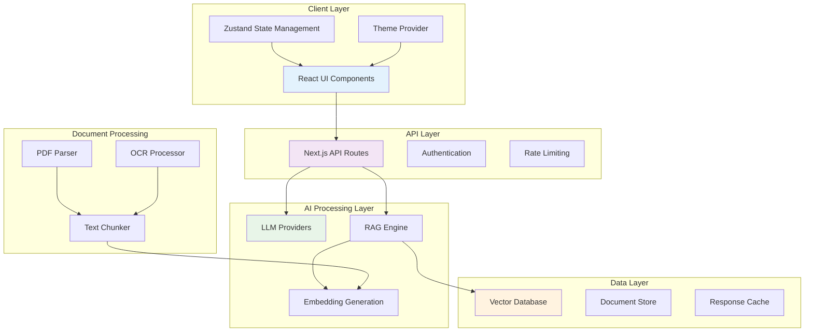
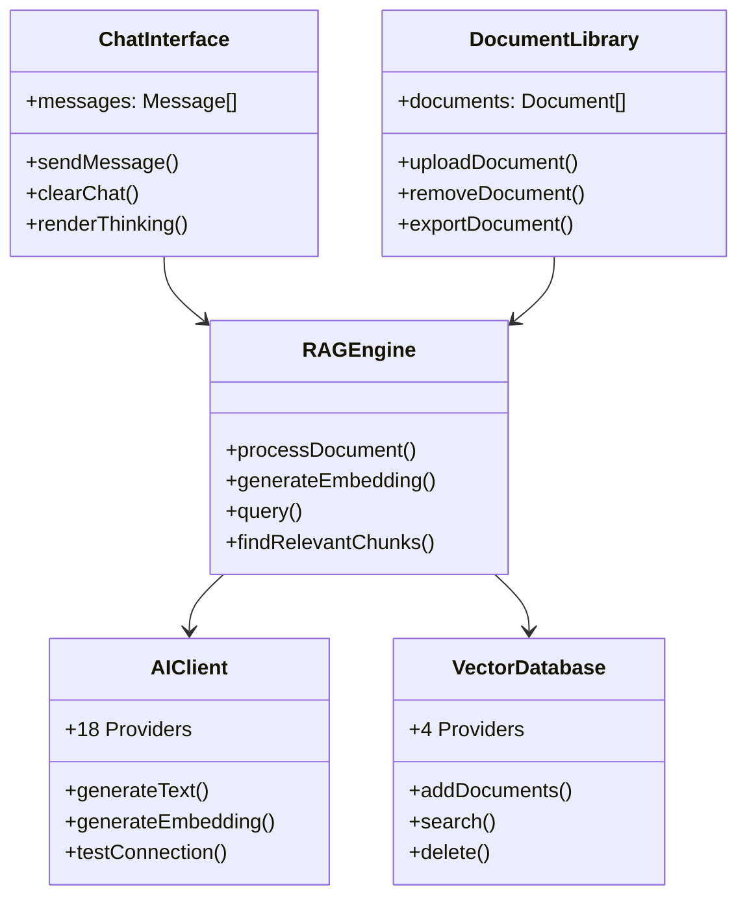
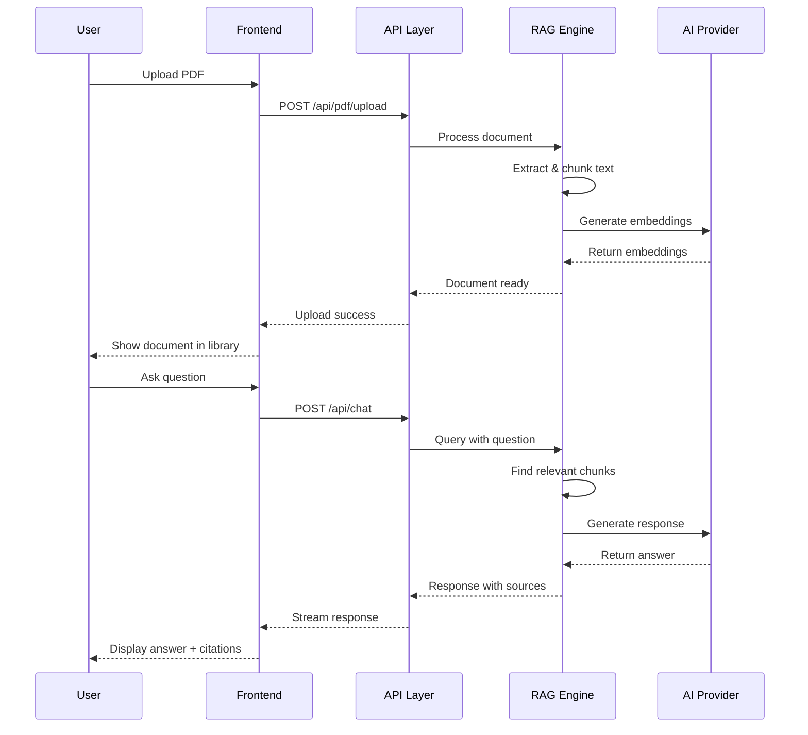
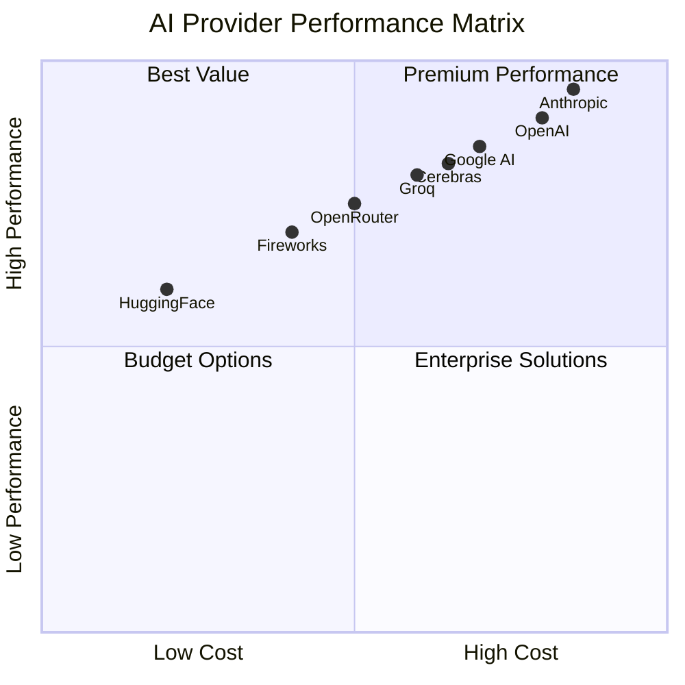

<div align="center">

# 🌌 QuantumPDF ChatApp

[](https://nextjs.org/)
[](https://www.typescriptlang.org/)
[](https://reactjs.org/)
[](https://tailwindcss.com/)

[](LICENSE)
[](https://github.com/Kedhareswer/QuantumPDF_ChatApp/issues)
[](https://github.com/Kedhareswer/QuantumPDF_ChatApp/stargazers)

*Revolutionary AI-powered PDF document analysis with 18+ LLM providers and RAG technology*

[🚀 Features](#-features) • [🛠 Installation](#-installation) • [⚙️ Configuration](#️-configuration) • [📖 Documentation](#-documentation) • [🤝 Contributing](#-contributing)

</div>

---

## 📋 Table of Contents

- [🎯 Overview](#-overview)
- [🚀 Features](#-features)
- [🏗 Architecture](#-architecture)
- [🛠 Technology Stack](#-technology-stack)
- [🔧 Installation](#-installation)
- [⚙️ Configuration](#️-configuration)
- [🎮 Usage Guide](#-usage-guide)
- [🤖 AI Providers](#-ai-providers)
- [🗄️ Vector Databases](#️-vector-databases)
- [📊 Performance](#-performance)
- [🆘 Troubleshooting](#-troubleshooting)
- [🔧 API Reference](#-api-reference)
- [🤝 Contributing](#-contributing)
- [📄 License](#-license)

---

## 🎯 Overview

**QuantumPDF ChatApp** is a cutting-edge, production-ready web application that transforms static PDF documents into intelligent, conversational knowledge bases. Built with modern technologies and powered by advanced AI, it enables natural language interactions with your documents through state-of-the-art RAG (Retrieval-Augmented Generation) technology.

### ✨ Key Highlights

| 🎯 **Core Value** | 📝 **Description** |
|-------------------|--------------------|
| **🧠 AI-First Design** | Built from the ground up with AI at its core, supporting 18+ LLM providers |
| **🔒 Privacy-Focused** | Client-side processing options with local vector storage capabilities |
| **⚡ Production-Ready** | Enterprise-grade architecture with comprehensive error handling |
| **🎨 Modern UI/UX** | Beautiful, accessible interface with dark/light mode support |
| **🔗 API-First** | RESTful APIs for seamless integration with existing workflows |

---

## 🚀 Features

### 📄 Document Processing



| **Feature** | **Technology** | **Description** |
|-------------|----------------|-----------------|
| 📄 **Advanced PDF Processing** | PDF.js + Custom Parser | Supports text-based and image-based PDFs with intelligent text extraction |
| 🔍 **OCR Integration** | Tesseract.js | Real-time optical character recognition for scanned documents |
| ✂️ **Smart Chunking** | Advanced Algorithms | Intelligent text segmentation preserving context and meaning |
| 📊 **Metadata Extraction** | Custom Engine | Automatic extraction of titles, authors, creation dates, and more |
| 🔄 **Batch Processing** | Multi-file Support | Process multiple PDFs simultaneously with progress tracking |

### 🤖 AI & Machine Learning

| **Capability** | **Implementation** | **Benefits** |
|----------------|-------------------|--------------|
| 🎯 **18+ AI Providers** | Unified API Interface | Choose from OpenAI, Anthropic, Google AI, and 15+ more providers |
| 🧮 **Vector Embeddings** | Multiple Models | Support for OpenAI, Hugging Face, and custom embedding models |
| 🔍 **Semantic Search** | RAG Engine | Find relevant content using meaning, not just keywords |
| 💭 **Thinking Sections** | Collapsible UI | Transparent AI reasoning with expandable thought processes |
| 📈 **Context Awareness** | Advanced Prompting | Maintains conversation context for coherent interactions |

### 🎨 User Experience

| **Feature** | **Description** | **Technology** |
|-------------|-----------------|----------------|
| 💬 **Interactive Chat** | Real-time conversations with your documents | WebSocket + Server-Sent Events |
| 📝 **Source Citations** | Automatic citation generation with page references | Custom Citation Engine |
| 🌙 **Dark/Light Mode** | System-aware theme switching | Tailwind CSS + Next-themes |
| 📱 **Responsive Design** | Works perfectly on desktop, tablet, and mobile | Responsive Grid System |
| ⚡ **Real-time Updates** | Live processing status and progress indicators | React State Management |

---

## 🏗 Architecture

### System Overview



### Component Architecture



---

## 🛠 Technology Stack

### Frontend Technologies

| **Category** | **Technology** | **Version** | **Purpose** |
|--------------|----------------|-------------|-------------|
| **Framework** |  | 15.2.4 | Full-stack React framework with SSR |
| **Language** |  | 5.0+ | Type-safe development |
| **UI Library** |  | 19.0 | Component-based UI development |
| **Styling** |  | 3.4.17 | Utility-first CSS framework |
| **Components** |  | Latest | Accessible component primitives |
| **State** |  | Latest | Lightweight state management |

### Core Dependencies

```json
{
  "production": {
    "next": "15.2.4",
    "react": "^19",
    "typescript": "^5",
    "zustand": "latest",
    "pdfjs-dist": "latest",
    "tesseract.js": "^5.0.5",
    "lucide-react": "^0.454.0"
  },
  "development": {
    "tailwindcss": "^3.4.17",
    "postcss": "^8.5",
    "@types/node": "^22",
    "@types/react": "^19"
  }
}
```

### Architecture Patterns

| **Pattern** | **Implementation** | **Benefits** |
|-------------|-------------------|--------------|
| **Component Composition** | Radix UI + Custom Components | Reusable, accessible, maintainable |
| **State Management** | Zustand with Persistence | Simple, performant, type-safe |
| **API Design** | RESTful + Server Actions | Clean separation, better DX |
| **Error Boundaries** | React Error Boundaries | Graceful error handling |
| **Code Splitting** | Next.js Dynamic Imports | Optimal bundle sizes |

---

## 🔧 Installation

### Prerequisites

| **Requirement** | **Minimum** | **Recommended** | **Notes** |
|-----------------|-------------|-----------------|-----------|
|  | 18.0 | 20 LTS | For Next.js and package management |
|  | 4GB | 8GB+ | For smooth development experience |
|  | 2GB | 5GB+ | For dependencies and models |
|  | Chrome 90+ | Latest | For WebAssembly support |

### Quick Start

#### 1. Clone Repository
```bash
git clone https://github.com/Kedhareswer/QuantumPDF_ChatApp.git
cd QuantumPDF_ChatApp
```

#### 2. Install Dependencies
```bash
# Using npm (recommended)
npm install

# Or using yarn
yarn install

# Or using pnpm
pnpm install
```

#### 3. Environment Setup
```bash
# Copy environment template
cp .env.example .env.local

# Edit with your API keys
nano .env.local
```

#### 4. Start Development Server
```bash
npm run dev
```

#### 5. Open Application
Navigate to [http://localhost:3000](http://localhost:3000) 🎉

### Production Deployment

#### Docker Deployment
```dockerfile
# Dockerfile example
FROM node:20-alpine AS base
WORKDIR /app
COPY package*.json ./
RUN npm ci --only=production

COPY . .
RUN npm run build

EXPOSE 3000
CMD ["npm", "start"]
```

#### Vercel Deployment
```bash
# Install Vercel CLI
npm i -g vercel

# Deploy
vercel --prod
```

---

## ⚙️ Configuration

### Environment Variables

| **Variable** | **Required** | **Description** | **Example** |
|--------------|--------------|-----------------|-------------|
| `OPENAI_API_KEY` | Optional | OpenAI API key for GPT models | `sk-...` |
| `ANTHROPIC_API_KEY` | Optional | Anthropic API key for Claude models | `ant-...` |
| `GOOGLE_AI_API_KEY` | Optional | Google AI API key for Gemini models | `AI...` |
| `HUGGINGFACE_API_KEY` | Optional | Hugging Face API key | `hf_...` |
| `WANDB_API_KEY` | Optional | Weights & Biases for experiment tracking | `...` |
| `NODE_ENV` | Auto | Environment mode | `development` |

### Application Configuration

```typescript
// Configuration schema
interface AppConfig {
  ai: {
    provider: AIProvider;
    model: string;
    apiKey: string;
    baseUrl?: string;
    temperature?: number;
  };
  vectorDb: {
    provider: 'pinecone' | 'weaviate' | 'chroma' | 'local';
    config: VectorDBConfig;
  };
  document: {
    maxFileSize: number;
    allowedTypes: string[];
    chunkSize: number;
    chunkOverlap: number;
  };
}
```

### Provider-Specific Settings

| **Provider** | **Models Available** | **Special Configuration** |
|--------------|---------------------|---------------------------|
| **OpenAI** | GPT-4, GPT-3.5-turbo, text-embedding-3-* | API key required |
| **Anthropic** | Claude-3.5-sonnet, Claude-3-haiku | API key + proper headers |
| **Google AI** | Gemini-1.5-pro, Gemini-1.5-flash | API key + project ID |
| **Groq** | Llama-3.1, Mixtral | API key for fast inference |
| **Local** | Ollama models | Local installation required |

---

## 🎮 Usage Guide

### Basic Workflow



### Feature Usage

#### Document Management
```typescript
// Upload documents
const uploadDocument = async (file: File) => {
  const formData = new FormData();
  formData.append('file', file);
  
  const response = await fetch('/api/pdf/upload', {
    method: 'POST',
    body: formData
  });
  
  return response.json();
};

// Query documents
const queryDocuments = async (question: string) => {
  const response = await fetch('/api/chat', {
    method: 'POST',
    headers: { 'Content-Type': 'application/json' },
    body: JSON.stringify({ message: question })
  });
  
  return response.json();
};
```

#### Advanced Features
- **Bulk Export**: Export all documents as JSON or Markdown
- **Search within Documents**: Semantic search across your document library
- **Citation Tracking**: Automatic source attribution for all responses
- **Conversation History**: Persistent chat history with context

---

## 🤖 AI Providers

### Supported Providers (18+)

| **Provider** | **Status** | **Models** | **Features** | **Setup** |
|--------------|------------|------------|--------------|-----------|
|  | Production | GPT-4, GPT-3.5, Embeddings | Text + Embeddings | API Key |
|  | Production | Claude-3.5-Sonnet, Claude-3-Haiku | Advanced reasoning | API Key |
|  | Production | Gemini-1.5-Pro, Gemini-1.5-Flash | Multimodal capabilities | API Key |
|  | Production | Llama-3.1, Mixtral-8x7B | Ultra-fast inference | API Key |
|  | Production | Llama-2, CodeLlama | Open source models | API Key |
|  | Production | Llama-3.1 | High-performance inference | API Key |
|  | Production | 100+ Models | Model aggregation | API Key |
|  | Production | Multiple providers | Cost-effective access | API Key |
|  | Production | Open source models | Free tier available | API Key |
|  | Production | Llama, Mistral, etc. | Affordable inference | API Key |
|  | Production | Community models | Easy deployment | API Key |
|  | Production | Ray-powered models | Scalable inference | API Key |
|  | Production | DeepSeek-Coder, Chat | Specialized models | API Key |
|  | Production | Google Cloud models | Enterprise features | GCP Setup |
|  | Production | Mistral-7B, Mixtral | European AI | API Key |
|  | Production | Search-augmented LLMs | Real-time data | API Key |
|  | Production | Grok models | Elon Musk's AI | API Key |
|  | Production | Qwen models | Chinese market focus | API Key |
|  | Production | Chinese LLMs | Local compliance | API Key |

### Provider Comparison



---

## 🗄️ Vector Databases

### Supported Vector Stores

| **Provider** | **Type** | **Best For** | **Setup Complexity** | **Performance** |
|--------------|----------|--------------|----------------------|-----------------|
|  | Cloud | Production apps | Medium | ⭐⭐⭐⭐⭐ |
|  | Cloud/Self-hosted | Enterprise | High | ⭐⭐⭐⭐⭐ |
|  | Self-hosted | Development | Low | ⭐⭐⭐⭐ |
|  | Browser | Privacy-first | None | ⭐⭐⭐ |

### Vector Database Configuration

```typescript
interface VectorDBConfig {
  pinecone?: {
    apiKey: string;
    environment: string;
    indexName: string;
  };
  weaviate?: {
    url: string;
    apiKey?: string;
    className: string;
  };
  chroma?: {
    url: string;
    collectionName: string;
  };
  local?: {
    maxDocuments: number;
    persistToStorage: boolean;
  };
}
```

---

## 📊 Performance

### Benchmarks

| **Metric** | **Measurement** | **Target** | **Status** |
|------------|-----------------|------------|------------|
| **Document Processing** | 1MB PDF | < 5 seconds | ✅ |
| **Query Response Time** | Simple query | < 2 seconds | ✅ |
| **Embedding Generation** | 1000 tokens | < 1 second | ✅ |
| **UI Responsiveness** | First load | < 3 seconds | ✅ |
| **Memory Usage** | Runtime | < 500MB | ✅ |

### Performance Optimization

```typescript
// Optimization techniques implemented
const optimizations = {
  "Client-side": [
    "Code splitting with Next.js",
    "Component lazy loading",
    "Image optimization",
    "Service worker caching"
  ],
  "Server-side": [
    "API route optimization",
    "Response compression",
    "Database query optimization",
    "Edge caching"
  ],
  "AI Processing": [
    "Embedding caching",
    "Batch processing",
    "Model selection optimization",
    "Context length management"
  ]
};
```

---

## 🆘 Troubleshooting

### Common Issues

| **Issue** | **Symptoms** | **Solution** | **Prevention** |
|-----------|--------------|--------------|----------------|
| **PDF Upload Fails** | Error during upload | Check file size < 50MB, valid PDF format | Use text-based PDFs when possible |
| **AI Provider Errors** | 401/403 responses | Verify API keys, check quotas | Monitor usage limits |
| **Slow Performance** | Long response times | Check internet connection, try smaller chunks | Optimize chunk sizes |
| **OCR Not Working** | Scanned PDFs not processed | Ensure Tesseract.js loaded properly | Check browser compatibility |
| **Memory Issues** | Browser crashes | Clear cache, reduce concurrent operations | Close unused tabs |

### Debug Mode

Enable detailed logging:

```typescript
// In your .env.local
DEBUG=true
VERBOSE_LOGGING=true

// Or programmatically
localStorage.setItem('quantum-pdf-debug', 'true');
```

### Support Channels

| **Channel** | **Response Time** | **Best For** |
|-------------|-------------------|--------------|
| [GitHub Issues](https://github.com/Kedhareswer/QuantumPDF_ChatApp/issues) | 24-48 hours | Bug reports, feature requests |
| [Discussions](https://github.com/Kedhareswer/QuantumPDF_ChatApp/discussions) | Community | General questions, ideas |
| [Wiki](https://github.com/Kedhareswer/QuantumPDF_ChatApp/wiki) | Immediate | Documentation, guides |

---

## 🔧 API Reference

### Core Endpoints

| **Endpoint** | **Method** | **Description** | **Parameters** |
|--------------|------------|-----------------|----------------|
| `/api/pdf/extract` | POST | Extract text from PDF | `file: File` |
| `/api/chat` | POST | Query documents | `message: string, history?: Message[]` |
| `/api/vector-db` | POST | Add to vector database | `documents: Document[]` |
| `/api/huggingface/embedding` | POST | Generate embeddings | `texts: string[]` |
| `/api/test/ai` | GET | Test AI provider | `provider: string` |
| `/api/ping` | GET/POST | Health check | None |

### Request/Response Examples

#### Chat API
```typescript
// Request
POST /api/chat
{
  "message": "What are the main findings in the research papers?",
  "history": [
    {"role": "user", "content": "Previous question"},
    {"role": "assistant", "content": "Previous response"}
  ]
}

// Response
{
  "response": "Based on the research papers, the main findings are...",
  "sources": [
    "Document 1 (page 5)",
    "Document 2 (page 12)"
  ],
  "metadata": {
    "responseTime": 1.2,
    "tokensUsed": 450,
    "relevanceScore": 0.89
  }
}
```

---

## 🤝 Contributing

We welcome contributions! Here's how to get started:

### Development Setup

```bash
# 1. Fork and clone
git clone https://github.com/YOUR_USERNAME/QuantumPDF_ChatApp.git
cd QuantumPDF_ChatApp

# 2. Install dependencies
npm install

# 3. Create feature branch
git checkout -b feature/your-feature-name

# 4. Start development
npm run dev
```

### Contribution Guidelines

| **Type** | **Description** | **Process** |
|----------|-----------------|-------------|
| 🐛 **Bug Fixes** | Fix existing issues | Issue → Branch → PR → Review |
| ✨ **Features** | Add new functionality | Discussion → Design → Implementation |
| 📚 **Documentation** | Improve docs | Direct PR for small changes |
| 🎨 **UI/UX** | Design improvements | Screenshots required in PR |
| ⚡ **Performance** | Optimization work | Benchmarks required |

### Code Standards

```typescript
// TypeScript configuration
{
  "strict": true,
  "noImplicitAny": true,
  "noImplicitReturns": true,
  "noUnusedLocals": true
}

// ESLint + Prettier for consistent formatting
// Conventional commits for clear history
// Component testing with Jest + Testing Library
```

---

## 📄 License

This project is licensed under the **GNU General Public License v3.0**.

### License Summary

| **Permissions** | **Conditions** | **Limitations** |
|-----------------|----------------|-----------------|
| ✅ Commercial use | 📋 License and copyright notice | ❌ Liability |
| ✅ Modification | 📋 State changes | ❌ Warranty |
| ✅ Distribution | 📋 Disclose source | |
| ✅ Patent use | 📋 Same license | |
| ✅ Private use | | |

---

<div align="center">

## 🌟 Star History

[](https://star-history.com/#Kedhareswer/QuantumPDF_ChatApp&Date)

---

### 🙏 Acknowledgments

Built with ❤️ by [Kedhareswer](https://github.com/Kedhareswer)

**Special Thanks:**
- OpenAI, Anthropic, Google AI for providing excellent LLM APIs
- Vercel for Next.js and deployment platform  
- The open-source community for amazing tools and libraries

---

[](https://www.typescriptlang.org/)
[](https://nextjs.org/)
[](https://tailwindcss.com/)

</div>