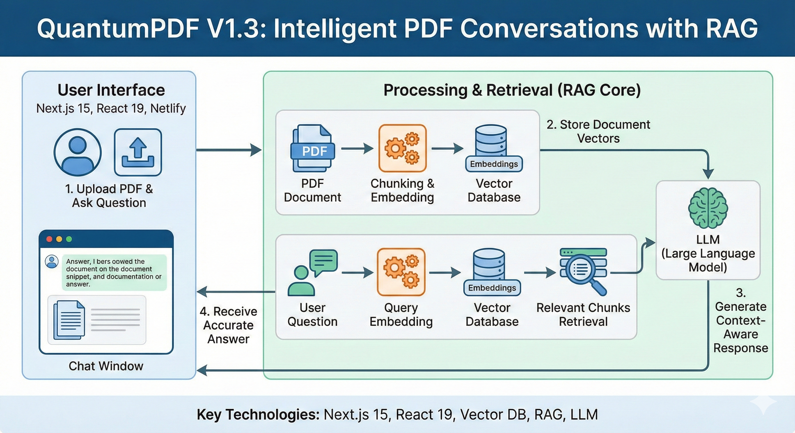

# QuantumPDF - AI Document Analysis Platform

> **Advanced document analysis with 3-phase RAG, domain agents, multimodal extraction, and 19 AI providers**
> **Version 3.0.0 | November 2025**


---
NOTE: THE BELOW INFOGRAPHIC IS FOR v1.3 --> We are currently v3.0


## 🌟 Features

### Core Capabilities

| Feature | Description |
|---------|-------------|
| **3-Phase RAG** | Context Analysis → Self-Critique → Refined Answer |
| **19 AI Providers** | OpenAI, Anthropic, Groq, DeepSeek, Mistral, and more |
| **Domain Agents** | Specialized analysis: analogies, compliance, key terms, summaries |
| **Mathpix Integration** | Professional equation OCR for LaTeX extraction |
| **Multimodal Processing** | Images, tables, equations extracted and analyzed |
| **Multi-Format Support** | PDF, DOCX, XLSX, CSV processing |
| **Local AI Models** | Transformers.js for on-device summarization |
| **PWA Support** | Install as desktop/mobile app |

### AI Provider Support

<table>
<tr>
<td>

**Cloud Providers**
- ✅ OpenAI
- ✅ Anthropic
- ✅ Google AI
- ✅ Groq
- ✅ Mistral
- ✅ DeepSeek
- ✅ Perplexity

</td>
<td>

**Alternative Providers**
- ✅ HuggingFace
- ✅ Fireworks
- ✅ DeepInfra
- ✅ XAI (Grok)
- ✅ Cerebras
- ✅ Replicate
- ✅ OpenRouter

</td>
<td>

**Enterprise Options**
- ✅ Vertex AI
- ✅ AIML
- ✅ Anyscale
- ✅ Alibaba
- ✅ MiniMax

</td>
</tr>
</table>

### Domain Agents

| Agent | Purpose | Model |
|-------|---------|-------|
| 🎯 **Analogy Maker** | Simplify complex concepts with everyday analogies | Cloud API |
| ⚖️ **Compliance Checker** | Legal/policy analysis, risk identification | Cloud API |
| 📚 **Key Terms** | Extract and define important vocabulary | Cloud API |
| 📝 **Summary** | Concise document summaries | Local (Transformers.js) or API |

---

## 🚀 Quick Start

### Prerequisites

- Node.js 18+
- npm 9+
- API key (OpenAI, Anthropic, or other supported provider)

### Installation

```bash
# Clone repository
git clone <repository-url>
cd QuantumPDF_ChatApp_VectorDB

# Install dependencies
npm install

# Configure environment
cp .env.example .env.local
# Edit .env.local with your API keys

# Start development server
npm run dev
```

Open [http://localhost:3000](http://localhost:3000)

### Environment Variables

```env
# Required: At least one AI provider
OPENAI_API_KEY=sk-...
ANTHROPIC_API_KEY=sk-ant-...
GROQ_API_KEY=gsk_...

# Optional: Enhanced equation extraction
MATHPIX_APP_ID=your_app_id
MATHPIX_APP_KEY=your_app_key

# Optional: Cloud vector database
PINECONE_API_KEY=your_key
PINECONE_ENVIRONMENT=us-east-1
```

---

## 📖 Usage

### Upload Documents

```
Supported formats: PDF, DOCX, DOC, XLSX, XLS, CSV, TSV
```

1. Click "Upload Documents" or drag & drop
2. Wait for processing (multimodal extraction)
3. Document appears in library

### Chat with Documents

1. Type your question
2. AI retrieves relevant context using 3-phase RAG
3. Response includes sources and confidence metrics

### Use Domain Agents

1. Expand "Advanced Controls" in chat
2. Select agent from dropdown
3. Enable/configure agent settings
4. Query - agent enhances response

### Configure Mathpix (Optional)

1. Go to Settings → Advanced tab
2. Enter Mathpix credentials
3. Toggle "Enable Mathpix"
4. Equation extraction now uses professional OCR

---

## 🏗 Architecture

```
┌─────────────────────────────────────────────────────────────────────────┐
│                            Frontend                                      │
│  ┌─────────────┐  ┌─────────────┐  ┌─────────────┐  ┌─────────────┐    │
│  │    Chat     │  │   Agent     │  │  Document   │  │   Config    │    │
│  │  Interface  │  │  Selector   │  │   Library   │  │   Panel     │    │
│  └─────────────┘  └─────────────┘  └─────────────┘  └─────────────┘    │
└─────────────────────────────────────────────────────────────────────────┘
                                    │
┌─────────────────────────────────────────────────────────────────────────┐
│                          Processing Layer                                │
│  ┌─────────────┐  ┌─────────────┐  ┌─────────────┐  ┌─────────────┐    │
│  │    PDF      │  │   Image     │  │   Table     │  │  Equation   │    │
│  │  Processor  │  │  Extractor  │  │  Extractor  │  │  Extractor  │    │
│  └─────────────┘  └─────────────┘  └─────────────┘  └─────────────┘    │
└─────────────────────────────────────────────────────────────────────────┘
                                    │
┌─────────────────────────────────────────────────────────────────────────┐
│                           RAG Engine                                     │
│  ┌─────────────┐  ┌─────────────┐  ┌─────────────┐                      │
│  │   Phase 1   │  │   Phase 2   │  │   Phase 3   │                      │
│  │  Context    │─▶│   Self      │─▶│   Refined   │                      │
│  │  Analysis   │  │  Critique   │  │   Answer    │                      │
│  └─────────────┘  └─────────────┘  └─────────────┘                      │
└─────────────────────────────────────────────────────────────────────────┘
                                    │
┌─────────────────────────────────────────────────────────────────────────┐
│                         Domain Agents                                    │
│  ┌───────────┐ ┌───────────┐ ┌───────────┐ ┌───────────┐               │
│  │  Analogy  │ │Compliance │ │ Key Terms │ │  Summary  │               │
│  │   Maker   │ │  Checker  │ │ Extractor │ │   Agent   │               │
│  └───────────┘ └───────────┘ └───────────┘ └───────────┘               │
└─────────────────────────────────────────────────────────────────────────┘
                                    │
┌─────────────────────────────────────────────────────────────────────────┐
│                          AI Providers                                    │
│  OpenAI │ Anthropic │ Groq │ DeepSeek │ Mistral │ 14+ more providers   │
└─────────────────────────────────────────────────────────────────────────┘
```

---

## 📁 Project Structure

```
QuantumPDF_ChatApp_VectorDB/
├── app/                    # Next.js app directory
│   ├── page.tsx           # Main page component
│   ├── layout.tsx         # Root layout
│   └── manifest.json      # PWA manifest
├── components/            # React components
│   ├── agent-selector.tsx # Agent selection UI
│   ├── chat-interface.tsx # Chat with streaming
│   ├── unified-pdf-processor.tsx # File upload
│   └── unified-configuration.tsx # Settings panel
├── lib/                   # Core libraries
│   ├── ai-client.ts       # Multi-provider AI client
│   ├── rag-engine.ts      # 3-phase RAG system
│   ├── domain-agents.ts   # Specialized agents
│   ├── mathpix-processor.ts # Equation OCR
│   ├── advanced-chunking.ts # Semantic chunking
│   └── store.ts           # Zustand state
├── types/                 # TypeScript definitions
├── docs/                  # Documentation
└── __tests__/             # Test files
```

---

## 🔧 Configuration

### AI Provider Settings

```typescript
// Configure in UI or programmatically
const aiConfig = {
  provider: 'openai',        // or 'anthropic', 'groq', etc.
  apiKey: 'sk-...',
  model: 'gpt-4o-mini',
  temperature: 0.7,
  maxTokens: 4096
}
```

### RAG Engine Settings

```typescript
const ragConfig = {
  maxChunksPerQuery: 25,     // Retrieved context limit
  minSimilarityScore: 0.5,   // Relevance threshold
  enableDiversityBoost: true, // Multi-document fairness
  enableRefinement: true     // 3-phase processing
}
```

### Agent Settings

```typescript
const agentSettings = {
  'analogy-maker': { enabled: true },
  'compliance-checker': { enabled: true },
  'key-terms': { enabled: true },
  'summary': { enabled: true, useLocalModels: true }
}
```

---

## 📊 Performance

| Metric | Target | Achieved |
|--------|--------|----------|
| PDF Processing (1MB) | <15s | ~12s ✅ |
| Embedding Generation | <5s | ~4.5s ✅ |
| Vector Search | <100ms | ~80ms ✅ |
| Chat Response | <5s | ~3.5s ✅ |
| Cached Response | <500ms | ~200ms ✅ |

---

## 🧪 Testing

```bash
# Run all tests
npm test

# Run with UI
npm run test:ui

# Generate coverage
npm run test:coverage

# Run specific test
npm test ai-client
```

---

## 📚 Documentation

| Document | Description |
|----------|-------------|
| [Quick Start](docs/QUICK_START_GUIDE.md) | 5-minute setup |
| [Architecture](docs/ARCHITECTURE_FLOWS.md) | System diagrams |
| [RAG Guide](docs/RAG_ARCHITECTURE.md) | RAG implementation |
| [Implementation](docs/IMPLEMENTATION_GUIDE.md) | Code reference |
| [Optimization](docs/OPTIMIZATION_GUIDE.md) | Performance tips |
| [Project Status](docs/PROJECT_STATUS.md) | Feature status |
| [PWA Guide](docs/PWA_GUIDE.md) | Progressive Web App |

---

## 🛠 Tech Stack

| Category | Technology |
|----------|------------|
| **Framework** | Next.js 15, React 18 |
| **Language** | TypeScript 5 |
| **Styling** | Tailwind CSS, shadcn/ui |
| **State** | Zustand |
| **PDF** | PDF.js |
| **Documents** | Mammoth.js, SheetJS, PapaParse |
| **Local AI** | Transformers.js |
| **Vector DB** | In-Memory, Pinecone, Weaviate |
| **Testing** | Vitest, Playwright |

---

## 🤝 Contributing

1. Fork the repository
2. Create feature branch (`git checkout -b feature/amazing-feature`)
3. Commit changes (`git commit -m 'Add amazing feature'`)
4. Push to branch (`git push origin feature/amazing-feature`)
5. Open Pull Request

---

## 📄 License

MIT License - see [LICENSE](LICENSE) for details.

---

## 🙏 Acknowledgments

- [OpenAI](https://openai.com) for GPT models
- [Anthropic](https://anthropic.com) for Claude models
- [Hugging Face](https://huggingface.co) for Transformers.js
- [Mathpix](https://mathpix.com) for equation OCR
- [Vercel](https://vercel.com) for Next.js
- [shadcn/ui](https://ui.shadcn.com) for UI components

---

<p align="center">
  <strong>Built with ❤️ for document intelligence</strong>
</p>
