# QuantumPDF Architecture & Flow Diagrams

> **Comprehensive visual guide to system architecture, data flows, and component interactions**
> **Last Updated: June 2026 | Version 3.1.0**

## Table of Contents
- [System Overview](#system-overview)
- [Core Architecture](#core-architecture)
- [Data Flow Diagrams](#data-flow-diagrams)
- [Component Interactions](#component-interactions)
- [Processing Pipelines](#processing-pipelines)
- [UI/UX Features](#uiux-features)
- [Multimodal Processing](#multimodal-processing)
- [State Management](#state-management)

---

## System Overview

### High-Level System Architecture

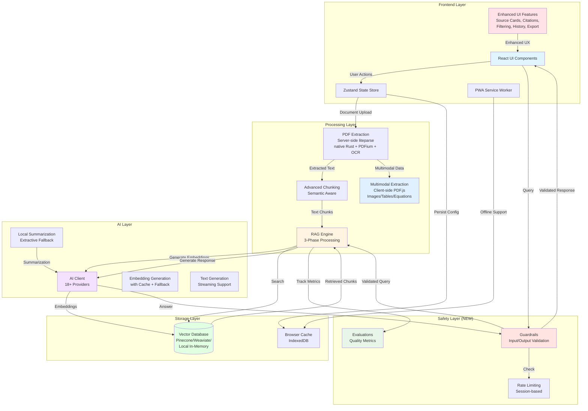

### Technology Stack

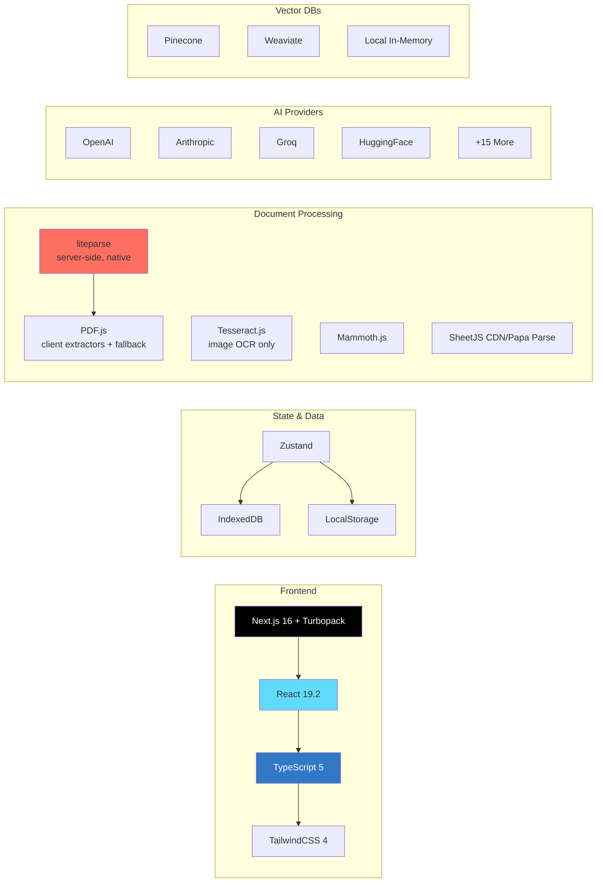

---

## Core Architecture

### RAG Engine Architecture

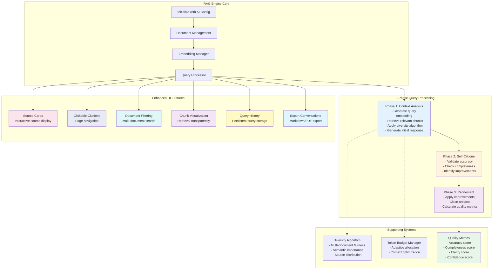

### Multi-Provider AI Client Architecture

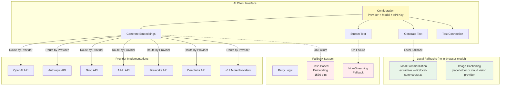

---

## Data Flow Diagrams

### Document Upload & Processing Flow

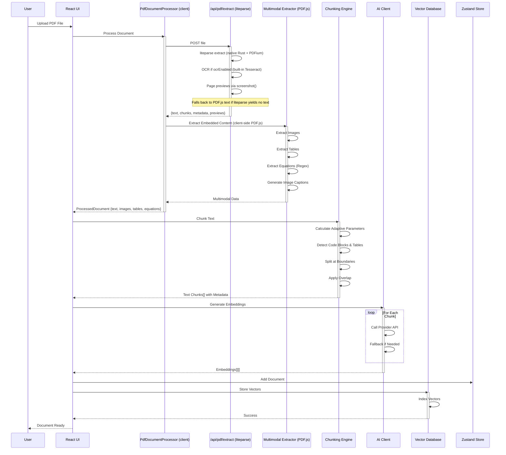

### Query Processing Flow (3-Phase RAG)

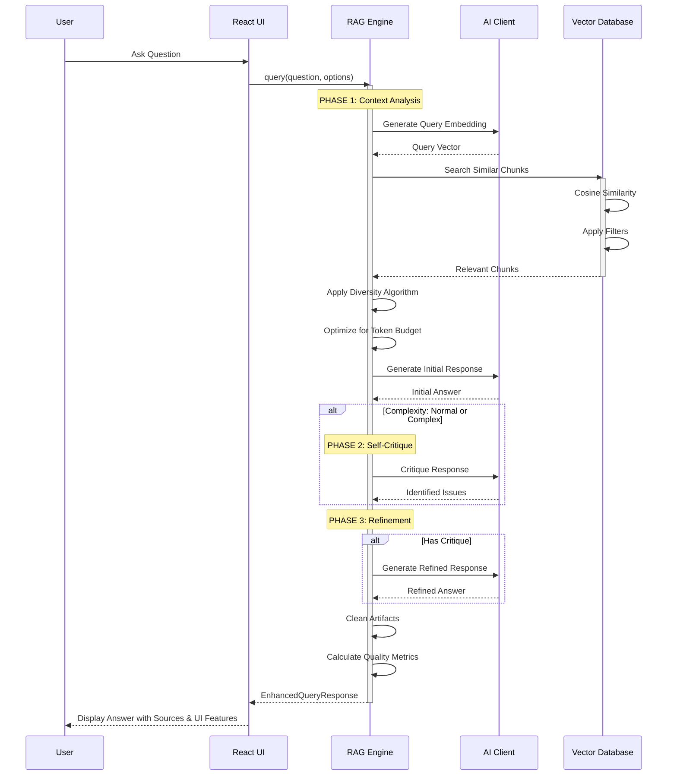

---

## Multimodal Processing

### Multimodal Extraction Pipeline

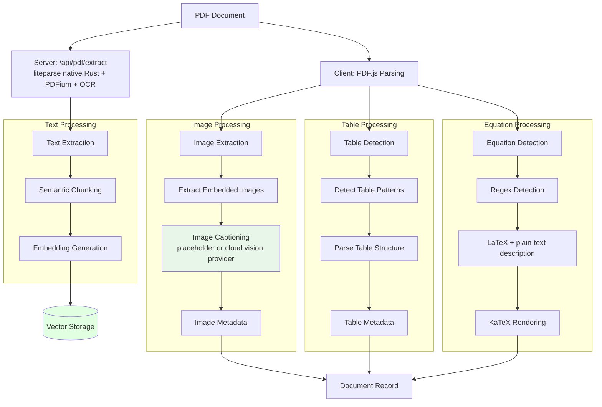

### Equation Extraction Flow (Regex-based)

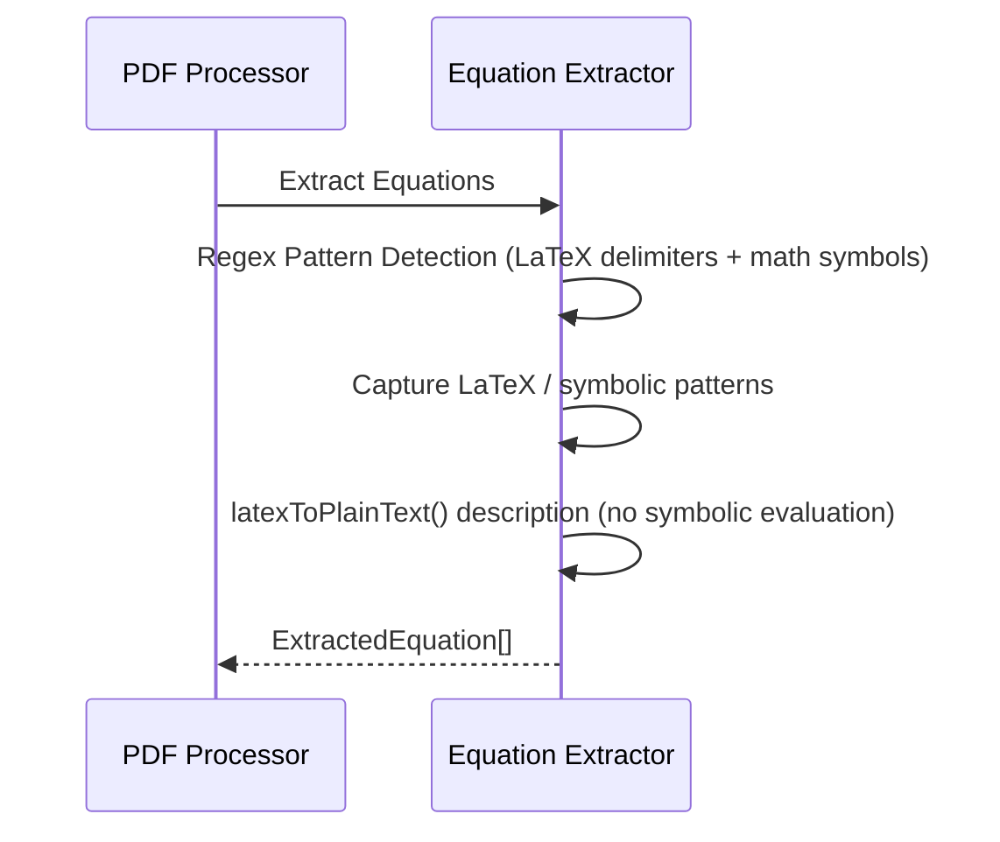

---

## Processing Pipelines

### Adaptive Chunking Pipeline

```mermaid
graph TD
    START[Extracted Text] --> LENGTH{Text Length?}

    LENGTH -->|> 20K chars| LARGE[Large Doc<br/>Chunk Size: 1000<br/>Overlap: 100]
    LENGTH -->|10K - 20K| MEDIUM[Medium Doc<br/>Chunk Size: 800<br/>Overlap: 80]
    LENGTH -->|5K - 10K| SMALL[Small Doc<br/>Chunk Size: 600<br/>Overlap: 60]
    LENGTH -->|< 5K| TINY[Tiny Doc<br/>Chunk Size: 400<br/>Overlap: 40]

    LARGE --> DETECT
    MEDIUM --> DETECT
    SMALL --> DETECT
    TINY --> DETECT

    DETECT[Detect Special Content]
    DETECT --> CODE{Code Block?}
    DETECT --> TABLE{Table?}
    DETECT --> IMG_CAP{Image Caption?}
    
    CODE -->|Yes| ATOMIC_CODE[Preserve as Atomic Unit]
    TABLE -->|Yes| ATOMIC_TBL[Preserve as Atomic Unit]
    IMG_CAP -->|Yes| ATOMIC_IMG[Preserve as Atomic Unit]
    
    CODE -->|No| BOUNDARY
    TABLE -->|No| BOUNDARY
    IMG_CAP -->|No| BOUNDARY

    BOUNDARY[Find Sentence Boundaries]
    ATOMIC_CODE --> BOUNDARY
    ATOMIC_TBL --> BOUNDARY
    ATOMIC_IMG --> BOUNDARY
    
    BOUNDARY --> PRESERVE[Preserve Page Markers]
    PRESERVE --> OVERLAP[Apply Overlap]
    OVERLAP --> VALIDATE[Validate Chunks]

    VALIDATE --> META[Add Chunk Metadata<br/>- Index<br/>- Start/End Position<br/>- Type (paragraph/code/table/image)<br/>- Semantic Importance]
    META --> OUTPUT[Text Chunks Array]

    style START fill:#e1f5ff
    style OUTPUT fill:#e8f5e9
    style LARGE fill:#ffebee
    style MEDIUM fill:#fff9c4
    style SMALL fill:#e0f2f1
    style TINY fill:#f3e5f5
    style ATOMIC_CODE fill:#e8eaf6
    style ATOMIC_TBL fill:#e8eaf6
```

### Multi-Format Document Processing

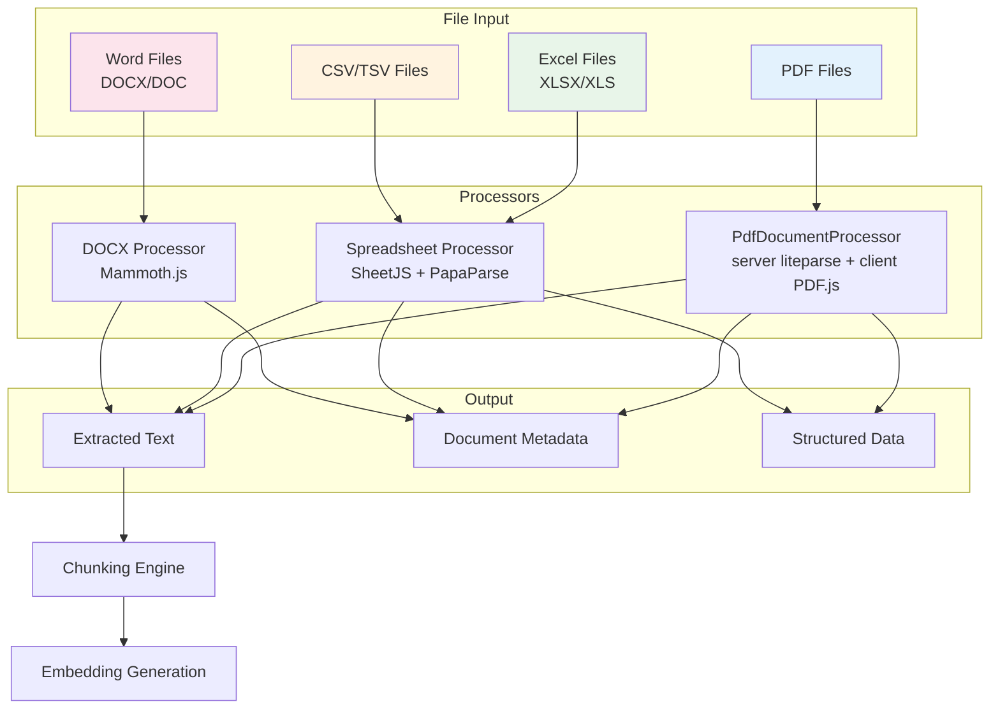

---

## State Management

### Application State Structure

```typescript
interface AppState {
  // Session State (Not Persisted)
  messages: Message[]           // Chat history
  documents: Document[]         // Uploaded documents
  isProcessing: boolean        // Processing state
  modelStatus: ModelStatus     // AI model status
  errors: ErrorMessage[]       // Error messages

  // Persisted State
  aiConfig: AIConfig           // AI provider configuration
  vectorDBConfig: VectorDBConfig // Vector DB configuration
  wandbConfig: WandbConfig     // W&B configuration (optional)


  // UI State (Persisted)
  activeTab: TabType          // Current active tab
  sidebarOpen: boolean        // Sidebar visibility (mobile)
  sidebarCollapsed: boolean   // Sidebar collapsed state

  // Actions
  addMessage: (message: Message) => void
  updateMessage: (id: string, partial: Partial<Message>) => void
  clearMessages: () => void
  addDocument: (document: Document) => void
  removeDocument: (id: string) => void
  clearDocuments: () => void
  setAIConfig: (config: AIConfig) => void
  setVectorDBConfig: (config: VectorDBConfig) => void
  // ... more actions
}
```

### State Management Flow

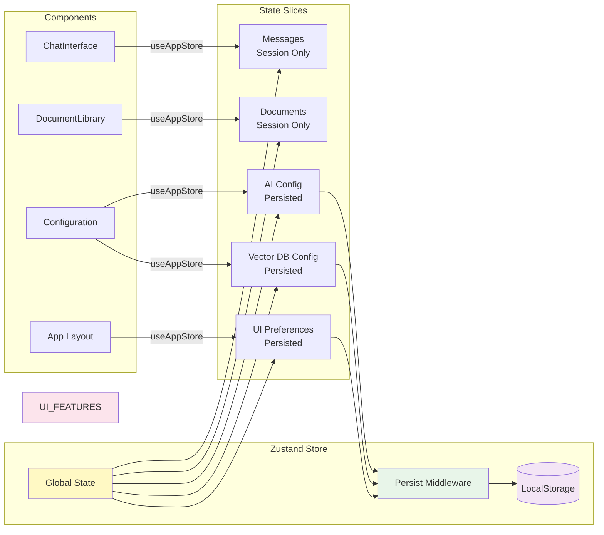

---

## Component Interactions

### React Component Hierarchy

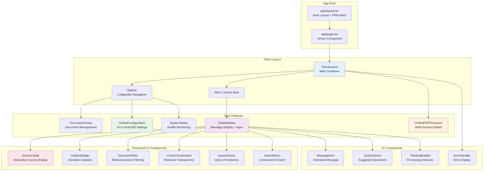

---

## Performance & Optimization

### Caching Strategy

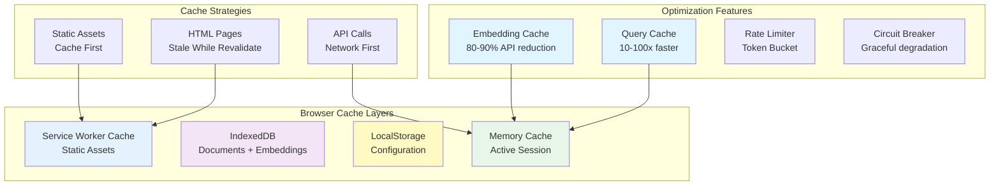

---

## Security & Privacy

### Data Privacy Flow

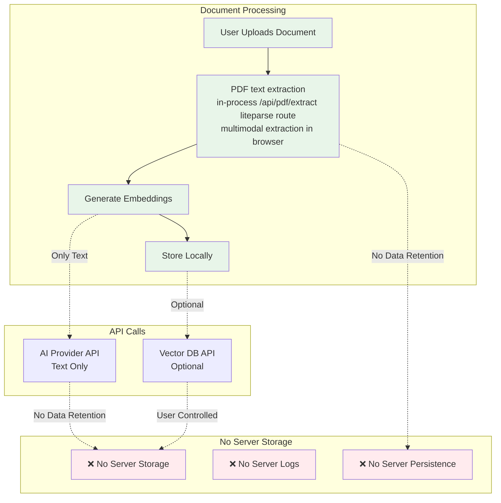

---

## Summary

This document provides comprehensive visual representations of:

1. **System Architecture** - Overall structure with enhanced UI features and multimodal support
2. **Core Components** - RAG engine, AI client, enhanced UI components
3. **Data Flows** - Document processing, query handling with 3-phase RAG
4. **Enhanced UI/UX Features** - Source cards, citations, filtering, chunk visualization, history, export
5. **Multimodal Processing** - Images, tables, equations (regex-based)
6. **Processing Pipelines** - PDF extraction, chunking, multi-format support
7. **State Management** - Zustand store with configuration persistence
8. **Performance** - Caching strategies and optimizations
9. **Security** - Privacy-focused architecture

These diagrams serve as a visual guide to understanding the complex interactions within the QuantumPDF ChatApp system.

---

**Last Updated**: June 2026
**Version**: 3.1.0
**New Features**: Server-side liteparse PDF pipeline, compact superscript RAG citations, Enhanced UI/UX Features, Guardrails, Evaluation Metrics
