# QuantumPDF Architecture & Flow Diagrams

> **Comprehensive visual guide to system architecture, data flows, and component interactions**

## Table of Contents
- [System Overview](#system-overview)
- [Core Architecture](#core-architecture)
- [Data Flow Diagrams](#data-flow-diagrams)
- [Component Interactions](#component-interactions)
- [Processing Pipelines](#processing-pipelines)
- [State Management](#state-management)

---

## System Overview

### High-Level System Architecture

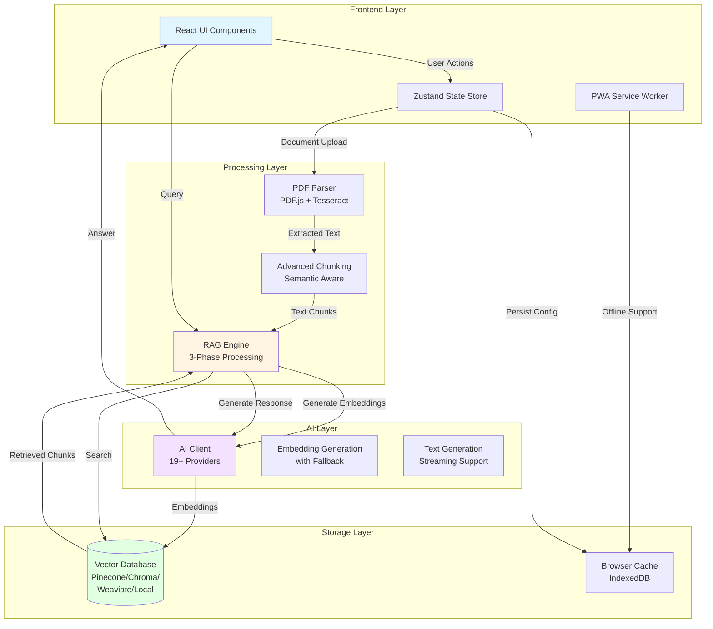
```mermaid
graph TB
    subgraph "Frontend Layer"
        UI[React UI Components]
        STATE[Zustand State Store]
        PWA[PWA Service Worker]
    end

    subgraph "Processing Layer"
        PDF[PDF Parser<br/>PDF.js + Tesseract]
        RAG[RAG Engine<br/>3-Phase Processing]
        CHUNK[Advanced Chunking<br/>Semantic Aware]
    end

    subgraph "AI Layer"
        AI[AI Client<br/>19+ Providers]
        EMB[Embedding Generation<br/>with Fallback]
        TEXT[Text Generation<br/>Streaming Support]
    end

    subgraph "Storage Layer"
        VDB[(Vector Database<br/>Pinecone/Chroma/<br/>Weaviate/Local)]
        CACHE[Browser Cache<br/>IndexedDB]
    end

    UI -->|User Actions| STATE
    STATE -->|Document Upload| PDF
    PDF -->|Extracted Text| CHUNK
    CHUNK -->|Text Chunks| RAG
    RAG -->|Generate Embeddings| AI
    AI -->|Embeddings| VDB
    UI -->|Query| RAG
    RAG -->|Search| VDB
    VDB -->|Retrieved Chunks| RAG
    RAG -->|Generate Response| AI
    AI -->|Answer| UI
    PWA -->|Offline Support| CACHE
    STATE -->|Persist Config| CACHE

    style UI fill:#e1f5ff
    style RAG fill:#fff4e1
    style AI fill:#f3e1ff
    style VDB fill:#e1ffe1
```

### Technology Stack

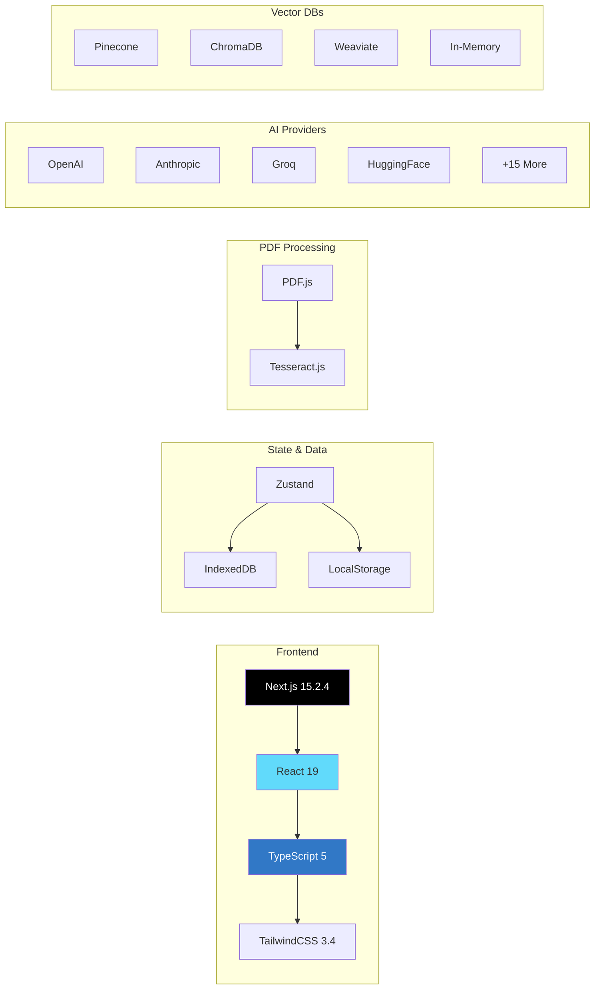
```mermaid
graph LR
    subgraph "Frontend"
        NEXT[Next.js 15.2.4]
        REACT[React 19]
        TS[TypeScript 5]
        TAIL[TailwindCSS 3.4]
    end

    subgraph "State & Data"
        ZUS[Zustand]
        IDB[IndexedDB]
        LOCAL[LocalStorage]
    end

    subgraph "PDF Processing"
        PDFJS[PDF.js]
        TESS[Tesseract.js]
    end

    subgraph "AI Providers"
        OAI[OpenAI]
        ANT[Anthropic]
        GROQ[Groq]
        HF[HuggingFace]
        MORE[+15 More]
    end

    subgraph "Vector DBs"
        PINE[Pinecone]
        CHROMA[ChromaDB]
        WEAV[Weaviate]
        MEM[In-Memory]
    end

    NEXT --> REACT
    REACT --> TS
    TS --> TAIL
    ZUS --> IDB
    ZUS --> LOCAL
    PDFJS --> TESS

    style NEXT fill:#000,color:#fff
    style REACT fill:#61dafb
    style TS fill:#3178c6,color:#fff
```

---

## Core Architecture

### RAG Engine Architecture

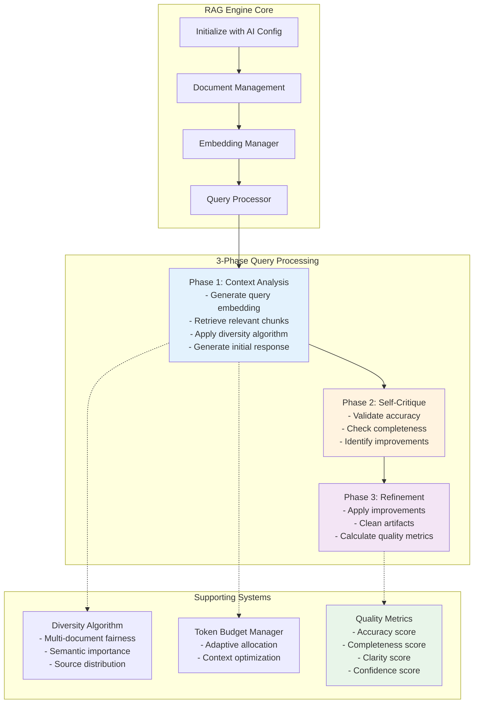
```mermaid
graph TD
    subgraph "RAG Engine Core"
        INIT[Initialize with AI Config]
        DOC[Document Management]
        EMB[Embedding Manager]
        QUERY[Query Processor]
    end

    subgraph "3-Phase Query Processing"
        P1[Phase 1: Context Analysis<br/>- Generate query embedding<br/>- Retrieve relevant chunks<br/>- Apply diversity algorithm<br/>- Generate initial response]
        P2[Phase 2: Self-Critique<br/>- Validate accuracy<br/>- Check completeness<br/>- Identify improvements]
        P3[Phase 3: Refinement<br/>- Apply improvements<br/>- Clean artifacts<br/>- Calculate quality metrics]
    end

    subgraph "Supporting Systems"
        DIV[Diversity Algorithm<br/>- Multi-document fairness<br/>- Semantic importance<br/>- Source distribution]
        TOKEN[Token Budget Manager<br/>- Adaptive allocation<br/>- Context optimization]
        QUALITY[Quality Metrics<br/>- Accuracy score<br/>- Completeness score<br/>- Clarity score<br/>- Confidence score]
    end

    INIT --> DOC
    DOC --> EMB
    EMB --> QUERY
    QUERY --> P1
    P1 --> P2
    P2 --> P3
    P1 -.-> DIV
    P1 -.-> TOKEN
    P3 -.-> QUALITY

    style P1 fill:#e3f2fd
    style P2 fill:#fff3e0
    style P3 fill:#f3e5f5
    style QUALITY fill:#e8f5e9
```

### Multi-Provider AI Client Architecture

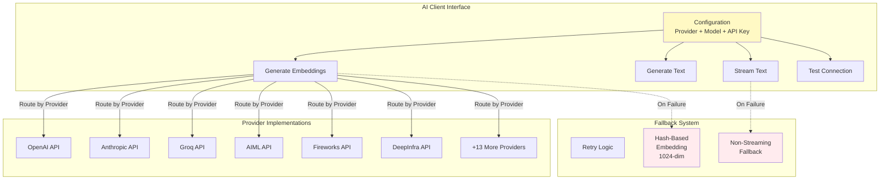
```mermaid
graph TB
    subgraph "AI Client Interface"
        CONFIG[Configuration<br/>Provider + Model + API Key]
        GEN[Generate Embeddings]
        CHAT[Generate Text]
        STREAM[Stream Text]
        TEST[Test Connection]
    end

    subgraph "Provider Implementations"
        OAI[OpenAI API]
        ANT[Anthropic API]
        GROQ[Groq API]
        AIML[AIML API]
        FW[Fireworks API]
        DI[DeepInfra API]
        OTHERS[+13 More Providers]
    end

    subgraph "Fallback System"
        RETRY[Retry Logic]
        HASHEMB[Hash-Based<br/>Embedding<br/>1024-dim]
        NOSTREAM[Non-Streaming<br/>Fallback]
    end

    CONFIG --> GEN
    CONFIG --> CHAT
    CONFIG --> STREAM
    CONFIG --> TEST

    GEN -->|Route by Provider| OAI
    GEN -->|Route by Provider| ANT
    GEN -->|Route by Provider| GROQ
    GEN -->|Route by Provider| AIML
    GEN -->|Route by Provider| FW
    GEN -->|Route by Provider| DI
    GEN -->|Route by Provider| OTHERS

    GEN -.->|On Failure| HASHEMB
    STREAM -.->|On Failure| NOSTREAM

    style CONFIG fill:#fff9c4
    style HASHEMB fill:#ffebee
    style NOSTREAM fill:#ffebee
```

---

## Data Flow Diagrams

### Document Upload & Processing Flow

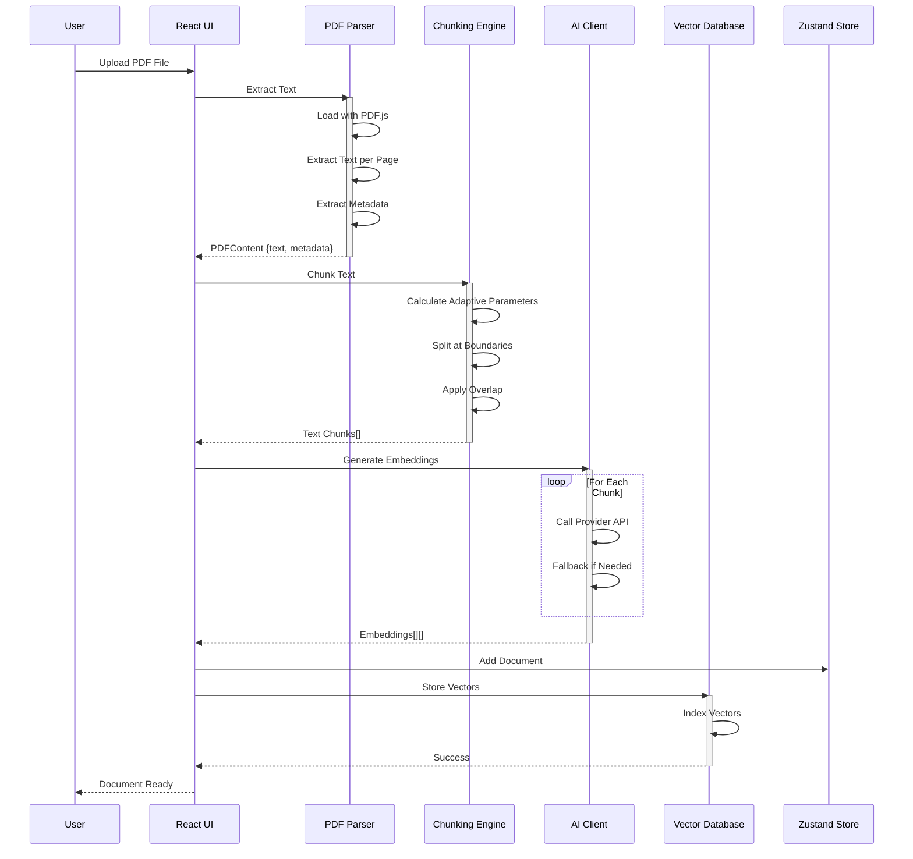
```mermaid
sequenceDiagram
    participant User
    participant UI as React UI
    participant PDF as PDF Parser
    participant CHUNK as Chunking Engine
    participant AI as AI Client
    participant VDB as Vector Database
    participant STORE as Zustand Store

    User->>UI: Upload PDF File
    UI->>PDF: Extract Text

    activate PDF
    PDF->>PDF: Load with PDF.js
    PDF->>PDF: Extract Text per Page
    PDF->>PDF: Extract Metadata
    PDF-->>UI: PDFContent {text, metadata}
    deactivate PDF

    UI->>CHUNK: Chunk Text

    activate CHUNK
    CHUNK->>CHUNK: Calculate Adaptive Parameters
    CHUNK->>CHUNK: Split at Boundaries
    CHUNK->>CHUNK: Apply Overlap
    CHUNK-->>UI: Text Chunks[]
    deactivate CHUNK

    UI->>AI: Generate Embeddings

    activate AI
    loop For Each Chunk
        AI->>AI: Call Provider API
        AI->>AI: Fallback if Needed
    end
    AI-->>UI: Embeddings[][]
    deactivate AI

    UI->>STORE: Add Document
    UI->>VDB: Store Vectors

    activate VDB
    VDB->>VDB: Index Vectors
    VDB-->>UI: Success
    deactivate VDB

    UI-->>User: Document Ready
```

### Query Processing Flow (3-Phase RAG)

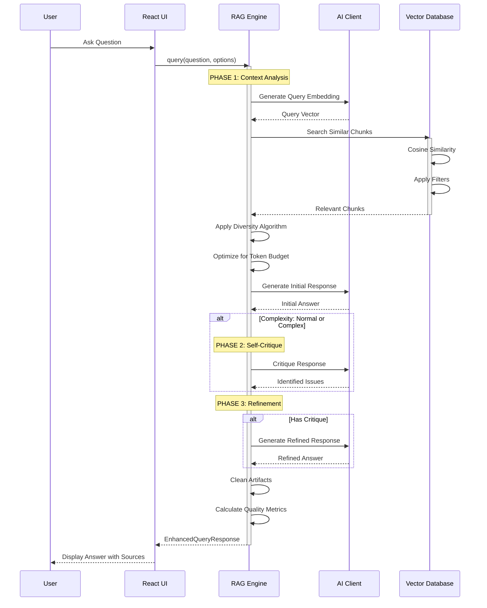
```mermaid
sequenceDiagram
    participant User
    participant UI as React UI
    participant RAG as RAG Engine
    participant AI as AI Client
    participant VDB as Vector Database

    User->>UI: Ask Question
    UI->>RAG: query(question, options)

    activate RAG

    Note over RAG: PHASE 1: Context Analysis
    RAG->>AI: Generate Query Embedding
    AI-->>RAG: Query Vector

    RAG->>VDB: Search Similar Chunks
    activate VDB
    VDB->>VDB: Cosine Similarity
    VDB->>VDB: Apply Filters
    VDB-->>RAG: Relevant Chunks
    deactivate VDB

    RAG->>RAG: Apply Diversity Algorithm
    RAG->>RAG: Optimize for Token Budget
    RAG->>AI: Generate Initial Response
    AI-->>RAG: Initial Answer

    alt Complexity: Normal or Complex
        Note over RAG: PHASE 2: Self-Critique
        RAG->>AI: Critique Response
        AI-->>RAG: Identified Issues
    end

    Note over RAG: PHASE 3: Refinement
    alt Has Critique
        RAG->>AI: Generate Refined Response
        AI-->>RAG: Refined Answer
    end

    RAG->>RAG: Clean Artifacts
    RAG->>RAG: Calculate Quality Metrics
    RAG-->>UI: EnhancedQueryResponse
    deactivate RAG

    UI-->>User: Display Answer with Sources
```

### Vector Search & Diversity Algorithm Flow

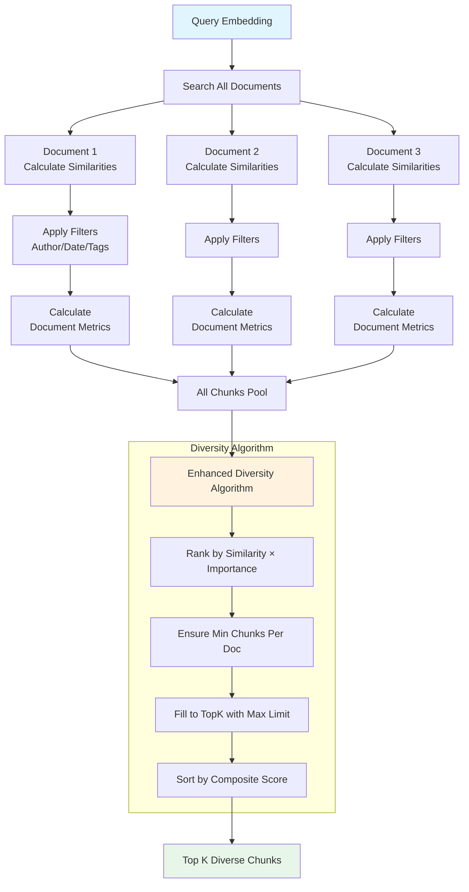
```mermaid
graph TD
    START[Query Embedding] --> SEARCH[Search All Documents]

    SEARCH --> DOC1[Document 1<br/>Calculate Similarities]
    SEARCH --> DOC2[Document 2<br/>Calculate Similarities]
    SEARCH --> DOC3[Document 3<br/>Calculate Similarities]

    DOC1 --> FILTER1[Apply Filters<br/>Author/Date/Tags]
    DOC2 --> FILTER2[Apply Filters]
    DOC3 --> FILTER3[Apply Filters]

    FILTER1 --> METRICS1[Calculate<br/>Document Metrics]
    FILTER2 --> METRICS2[Calculate<br/>Document Metrics]
    FILTER3 --> METRICS3[Calculate<br/>Document Metrics]

    METRICS1 --> POOL[All Chunks Pool]
    METRICS2 --> POOL
    METRICS3 --> POOL

    POOL --> DIV[Enhanced Diversity Algorithm]

    subgraph "Diversity Algorithm"
        DIV --> RANK[Rank by Similarity × Importance]
        RANK --> FAIR[Ensure Min Chunks Per Doc]
        FAIR --> FILL[Fill to TopK with Max Limit]
        FILL --> SORT[Sort by Composite Score]
    end

    SORT --> RESULT[Top K Diverse Chunks]

    style START fill:#e1f5ff
    style RESULT fill:#e8f5e9
    style DIV fill:#fff3e0
```

---

## Component Interactions

### React Component Hierarchy

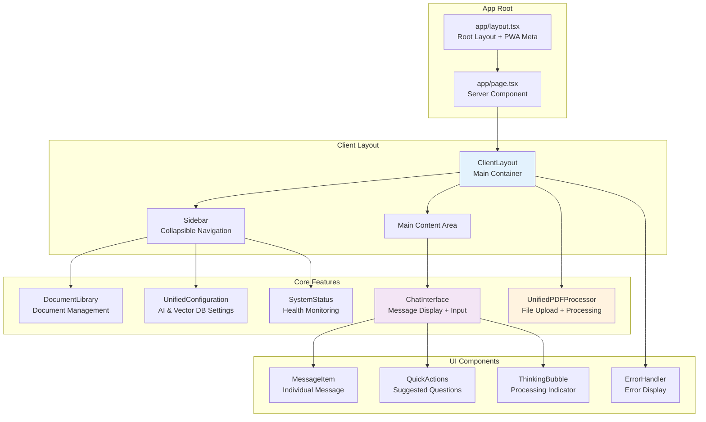
```mermaid
graph TB
    subgraph "App Root"
        LAYOUT[app/layout.tsx<br/>Root Layout + PWA Meta]
        PAGE[app/page.tsx<br/>Server Component]
    end

    subgraph "Client Layout"
        CLIENT[ClientLayout<br/>Main Container]
        SIDEBAR[Sidebar<br/>Collapsible Navigation]
        MAIN[Main Content Area]
    end

    subgraph "Core Features"
        CHAT[ChatInterface<br/>Message Display + Input]
        DOCS[DocumentLibrary<br/>Document Management]
        UPLOAD[UnifiedPDFProcessor<br/>File Upload + Processing]
        CONFIG[UnifiedConfiguration<br/>AI & Vector DB Settings]
        STATUS[SystemStatus<br/>Health Monitoring]
    end

    subgraph "UI Components"
        MSG[MessageItem<br/>Individual Message]
        QUICK[QuickActions<br/>Suggested Questions]
        THINKING[ThinkingBubble<br/>Processing Indicator]
        ERRORS[ErrorHandler<br/>Error Display]
    end

    LAYOUT --> PAGE
    PAGE --> CLIENT
    CLIENT --> SIDEBAR
    CLIENT --> MAIN

    SIDEBAR --> DOCS
    SIDEBAR --> CONFIG
    SIDEBAR --> STATUS

    MAIN --> CHAT

    CHAT --> MSG
    CHAT --> QUICK
    CHAT --> THINKING

    CLIENT --> UPLOAD
    CLIENT --> ERRORS

    style CLIENT fill:#e3f2fd
    style CHAT fill:#f3e5f5
    style UPLOAD fill:#fff3e0
```

### State Management Flow

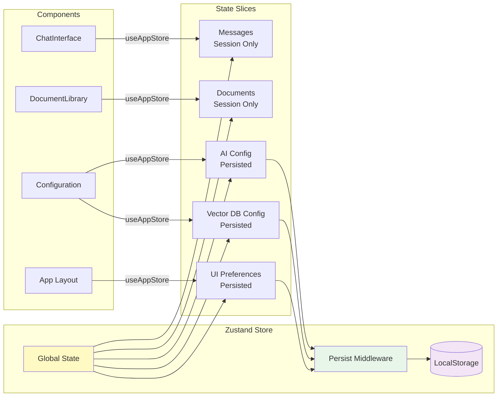
```mermaid
graph LR
    subgraph "Zustand Store"
        STATE[Global State]
        PERSIST[Persist Middleware]
        LOCAL[(LocalStorage)]
    end

    subgraph "State Slices"
        MSGS[Messages<br/>Session Only]
        DOCS[Documents<br/>Session Only]
        AI[AI Config<br/>Persisted]
        VDB[Vector DB Config<br/>Persisted]
        UI[UI Preferences<br/>Persisted]
    end

    subgraph "Components"
        CHAT[ChatInterface]
        LIB[DocumentLibrary]
        CFG[Configuration]
        APP[App Layout]
    end

    STATE --> MSGS
    STATE --> DOCS
    STATE --> AI
    STATE --> VDB
    STATE --> UI

    AI --> PERSIST
    VDB --> PERSIST
    UI --> PERSIST
    PERSIST --> LOCAL

    CHAT -->|useAppStore| MSGS
    LIB -->|useAppStore| DOCS
    CFG -->|useAppStore| AI
    CFG -->|useAppStore| VDB
    APP -->|useAppStore| UI

    style STATE fill:#fff9c4
    style PERSIST fill:#e8f5e9
    style LOCAL fill:#f3e5f5
```

---

## Processing Pipelines

### PDF Text Extraction Pipeline

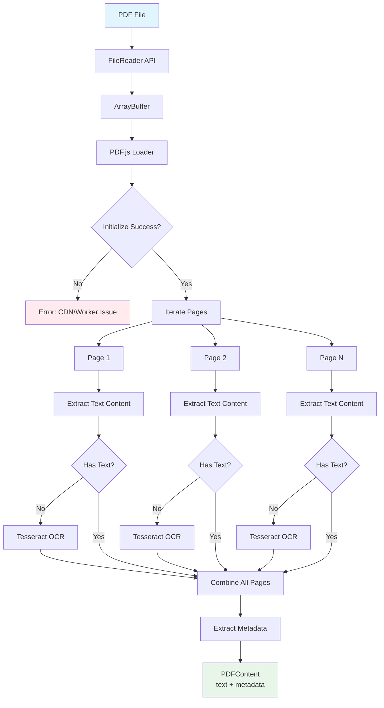
```mermaid
graph TD
    START[PDF File] --> READER[FileReader API]
    READER --> BUFFER[ArrayBuffer]
    BUFFER --> PDFJS[PDF.js Loader]

    PDFJS --> INIT{Initialize Success?}
    INIT -->|No| ERROR1[Error: CDN/Worker Issue]
    INIT -->|Yes| PAGES[Iterate Pages]

    PAGES --> PAGE1[Page 1]
    PAGES --> PAGE2[Page 2]
    PAGES --> PAGEN[Page N]

    PAGE1 --> TEXT1[Extract Text Content]
    PAGE2 --> TEXT2[Extract Text Content]
    PAGEN --> TEXTN[Extract Text Content]

    TEXT1 --> CHECK1{Has Text?}
    TEXT2 --> CHECK2{Has Text?}
    TEXTN --> CHECKN{Has Text?}

    CHECK1 -->|No| OCR1[Tesseract OCR]
    CHECK2 -->|No| OCR2[Tesseract OCR]
    CHECKN -->|No| OCRN[Tesseract OCR]

    CHECK1 -->|Yes| COMBINE[Combine All Pages]
    CHECK2 -->|Yes| COMBINE
    CHECKN -->|Yes| COMBINE
    OCR1 --> COMBINE
    OCR2 --> COMBINE
    OCRN --> COMBINE

    COMBINE --> META[Extract Metadata]
    META --> OUTPUT[PDFContent<br/>text + metadata]

    style START fill:#e1f5ff
    style OUTPUT fill:#e8f5e9
    style ERROR1 fill:#ffebee
```

### Adaptive Chunking Pipeline

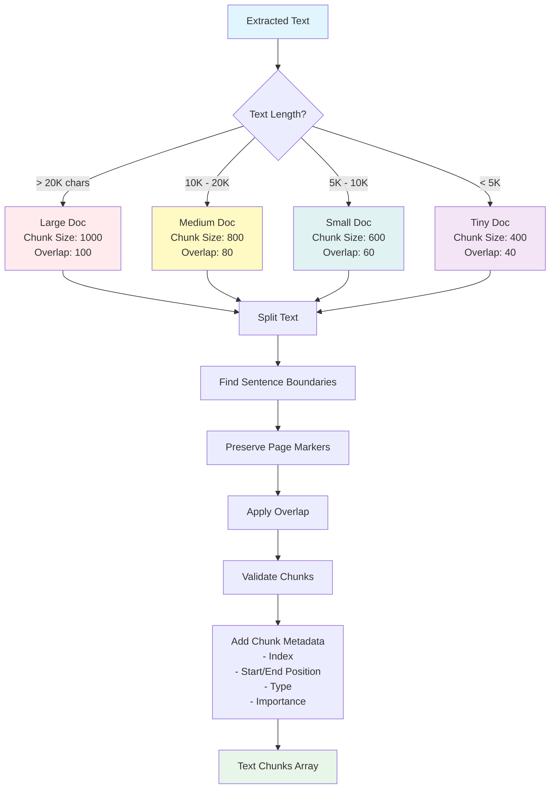
```mermaid
graph TD
    START[Extracted Text] --> LENGTH{Text Length?}

    LENGTH -->|> 20K chars| LARGE[Large Doc<br/>Chunk Size: 1000<br/>Overlap: 100]
    LENGTH -->|10K - 20K| MEDIUM[Medium Doc<br/>Chunk Size: 800<br/>Overlap: 80]
    LENGTH -->|5K - 10K| SMALL[Small Doc<br/>Chunk Size: 600<br/>Overlap: 60]
    LENGTH -->|< 5K| TINY[Tiny Doc<br/>Chunk Size: 400<br/>Overlap: 40]

    LARGE --> SPLIT[Split Text]
    MEDIUM --> SPLIT
    SMALL --> SPLIT
    TINY --> SPLIT

    SPLIT --> BOUNDARY[Find Sentence Boundaries]
    BOUNDARY --> PRESERVE[Preserve Page Markers]
    PRESERVE --> OVERLAP[Apply Overlap]
    OVERLAP --> VALIDATE[Validate Chunks]

    VALIDATE --> META[Add Chunk Metadata<br/>- Index<br/>- Start/End Position<br/>- Type<br/>- Importance]
    META --> OUTPUT[Text Chunks Array]

    style START fill:#e1f5ff
    style OUTPUT fill:#e8f5e9
    style LARGE fill:#ffebee
    style MEDIUM fill:#fff9c4
    style SMALL fill:#e0f2f1
    style TINY fill:#f3e5f5
```

### Embedding Generation Pipeline

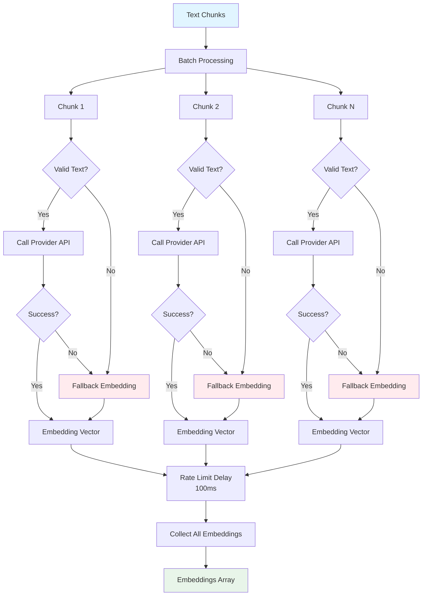
```mermaid
graph TD
    START[Text Chunks] --> BATCH[Batch Processing]

    BATCH --> CHUNK1[Chunk 1]
    BATCH --> CHUNK2[Chunk 2]
    BATCH --> CHUNKN[Chunk N]

    CHUNK1 --> VALIDATE1{Valid Text?}
    CHUNK2 --> VALIDATE2{Valid Text?}
    CHUNKN --> VALIDATEN{Valid Text?}

    VALIDATE1 -->|Yes| API1[Call Provider API]
    VALIDATE2 -->|Yes| API2[Call Provider API]
    VALIDATEN -->|Yes| APIN[Call Provider API]

    VALIDATE1 -->|No| FALLBACK1[Fallback Embedding]
    VALIDATE2 -->|No| FALLBACK2[Fallback Embedding]
    VALIDATEN -->|No| FALLBACKN[Fallback Embedding]

    API1 --> SUCCESS1{Success?}
    API2 --> SUCCESS2{Success?}
    APIN --> SUCCESSN{Success?}

    SUCCESS1 -->|Yes| EMB1[Embedding Vector]
    SUCCESS2 -->|Yes| EMB2[Embedding Vector]
    SUCCESSN -->|Yes| EMBN[Embedding Vector]

    SUCCESS1 -->|No| FALLBACK1
    SUCCESS2 -->|No| FALLBACK2
    SUCCESSN -->|No| FALLBACKN

    FALLBACK1 --> EMB1
    FALLBACK2 --> EMB2
    FALLBACKN --> EMBN

    EMB1 --> RATE[Rate Limit Delay<br/>100ms]
    EMB2 --> RATE
    EMBN --> RATE

    RATE --> COLLECT[Collect All Embeddings]
    COLLECT --> OUTPUT[Embeddings Array]

    style START fill:#e1f5ff
    style OUTPUT fill:#e8f5e9
    style FALLBACK1 fill:#ffebee
    style FALLBACK2 fill:#ffebee
    style FALLBACKN fill:#ffebee
```

### Token Budget Allocation

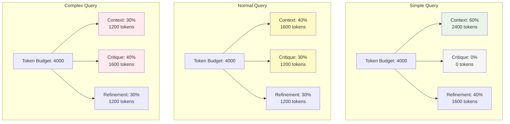
```mermaid
graph TB
    subgraph "Simple Query"
        S_BUDGET[Token Budget: 4000]
        S_CONTEXT[Context: 60%<br/>2400 tokens]
        S_CRITIQUE[Critique: 0%<br/>0 tokens]
        S_REFINE[Refinement: 40%<br/>1600 tokens]

        S_BUDGET --> S_CONTEXT
        S_BUDGET --> S_CRITIQUE
        S_BUDGET --> S_REFINE
    end

    subgraph "Normal Query"
        N_BUDGET[Token Budget: 4000]
        N_CONTEXT[Context: 40%<br/>1600 tokens]
        N_CRITIQUE[Critique: 30%<br/>1200 tokens]
        N_REFINE[Refinement: 30%<br/>1200 tokens]

        N_BUDGET --> N_CONTEXT
        N_BUDGET --> N_CRITIQUE
        N_BUDGET --> N_REFINE
    end

    subgraph "Complex Query"
        C_BUDGET[Token Budget: 4000]
        C_CONTEXT[Context: 30%<br/>1200 tokens]
        C_CRITIQUE[Critique: 40%<br/>1600 tokens]
        C_REFINE[Refinement: 30%<br/>1200 tokens]

        C_BUDGET --> C_CONTEXT
        C_BUDGET --> C_CRITIQUE
        C_BUDGET --> C_REFINE
    end

    style S_CONTEXT fill:#e8f5e9
    style N_CONTEXT fill:#fff9c4
    style C_CONTEXT fill:#ffebee
    style S_CRITIQUE fill:#f5f5f5
    style N_CRITIQUE fill:#fff9c4
    style C_CRITIQUE fill:#ffebee
```

---

## State Management

### Application State Structure

```typescript
interface AppState {
  // Session State (Not Persisted)
  messages: Message[]           // Chat history
  documents: Document[]         // Uploaded documents
  isProcessing: boolean        // Processing state
  modelStatus: ModelStatus     // AI model status
  errors: ErrorMessage[]       // Error messages

  // Persisted State
  aiConfig: AIConfig           // AI provider configuration
  vectorDBConfig: VectorDBConfig // Vector DB configuration
  wandbConfig: WandbConfig     // W&B configuration (optional)

  // UI State (Persisted)
  activeTab: TabType          // Current active tab
  sidebarOpen: boolean        // Sidebar visibility (mobile)
  sidebarCollapsed: boolean   // Sidebar collapsed state

  // Actions
  addMessage: (message: Message) => void
  updateMessage: (id: string, partial: Partial<Message>) => void
  clearMessages: () => void
  addDocument: (document: Document) => void
  removeDocument: (id: string) => void
  clearDocuments: () => void
  setAIConfig: (config: AIConfig) => void
  setVectorDBConfig: (config: VectorDBConfig) => void
  // ... more actions
}
```

### Message Flow Through State

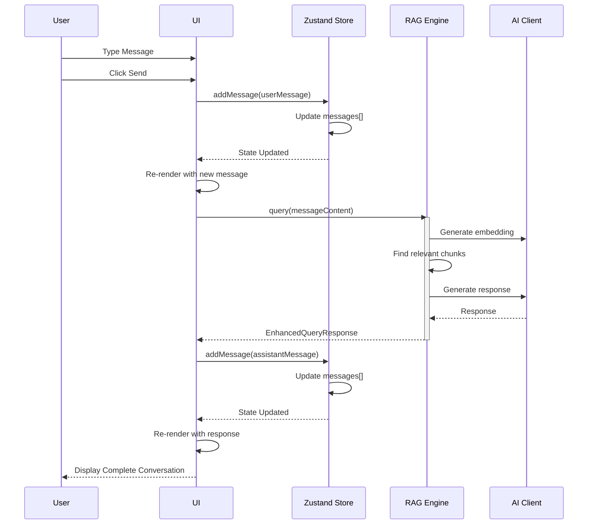
```mermaid
sequenceDiagram
    participant User
    participant UI
    participant Store as Zustand Store
    participant RAG as RAG Engine
    participant AI as AI Client

    User->>UI: Type Message
    User->>UI: Click Send

    UI->>Store: addMessage(userMessage)
    Store->>Store: Update messages[]
    Store-->>UI: State Updated
    UI->>UI: Re-render with new message

    UI->>RAG: query(messageContent)

    activate RAG
    RAG->>AI: Generate embedding
    RAG->>RAG: Find relevant chunks
    RAG->>AI: Generate response
    AI-->>RAG: Response
    RAG-->>UI: EnhancedQueryResponse
    deactivate RAG

    UI->>Store: addMessage(assistantMessage)
    Store->>Store: Update messages[]
    Store-->>UI: State Updated
    UI->>UI: Re-render with response

    UI-->>User: Display Complete Conversation
```

---

## Performance & Optimization

### Caching Strategy

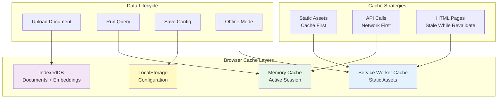
```mermaid
graph TB
    subgraph "Browser Cache Layers"
        PWA[Service Worker Cache<br/>Static Assets]
        IDB[IndexedDB<br/>Documents + Embeddings]
        LOCAL[LocalStorage<br/>Configuration]
        MEM[Memory Cache<br/>Active Session]
    end

    subgraph "Cache Strategies"
        STATIC[Static Assets<br/>Cache First]
        API[API Calls<br/>Network First]
        HTML[HTML Pages<br/>Stale While Revalidate]
    end

    subgraph "Data Lifecycle"
        UPLOAD[Upload Document] --> IDB
        QUERY[Run Query] --> MEM
        CONFIG[Save Config] --> LOCAL
        OFFLINE[Offline Mode] --> PWA
    end

    STATIC --> PWA
    API --> MEM
    HTML --> PWA

    style PWA fill:#e3f2fd
    style IDB fill:#f3e5f5
    style LOCAL fill:#fff9c4
    style MEM fill:#e8f5e9
```

### Fallback Mechanisms

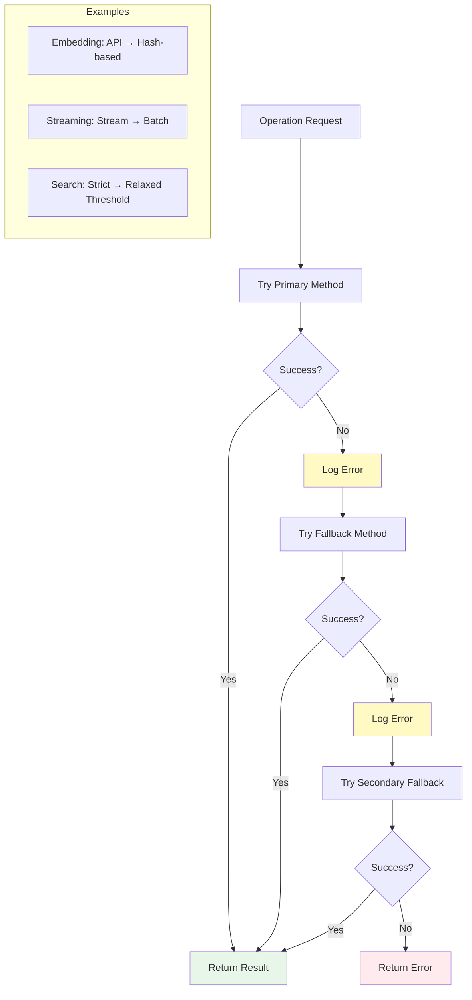
```mermaid
graph TD
    START[Operation Request] --> TRY1[Try Primary Method]

    TRY1 --> CHECK1{Success?}
    CHECK1 -->|Yes| SUCCESS[Return Result]
    CHECK1 -->|No| LOG1[Log Error]

    LOG1 --> TRY2[Try Fallback Method]
    TRY2 --> CHECK2{Success?}
    CHECK2 -->|Yes| SUCCESS
    CHECK2 -->|No| LOG2[Log Error]

    LOG2 --> TRY3[Try Secondary Fallback]
    TRY3 --> CHECK3{Success?}
    CHECK3 -->|Yes| SUCCESS
    CHECK3 -->|No| FAIL[Return Error]

    subgraph "Examples"
        EX1[Embedding: API → Hash-based]
        EX2[Streaming: Stream → Batch]
        EX3[Search: Strict → Relaxed Threshold]
    end

    style SUCCESS fill:#e8f5e9
    style FAIL fill:#ffebee
    style LOG1 fill:#fff9c4
    style LOG2 fill:#fff9c4
```

---

## Error Handling

### Error Propagation Flow

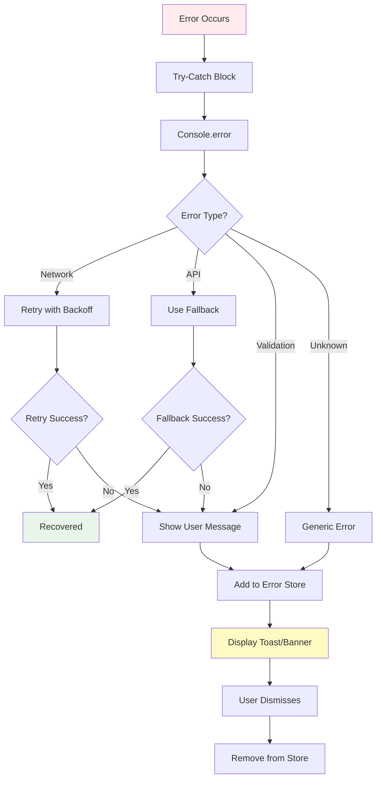
```mermaid
graph TD
    ERROR[Error Occurs] --> CATCH[Try-Catch Block]

    CATCH --> LOG[Console.error]
    LOG --> IDENTIFY{Error Type?}

    IDENTIFY -->|Network| RETRY[Retry with Backoff]
    IDENTIFY -->|API| FALLBACK[Use Fallback]
    IDENTIFY -->|Validation| USER_MSG[Show User Message]
    IDENTIFY -->|Unknown| GENERIC[Generic Error]

    RETRY --> SUCCESS1{Retry Success?}
    SUCCESS1 -->|Yes| RECOVER[Recovered]
    SUCCESS1 -->|No| USER_MSG

    FALLBACK --> SUCCESS2{Fallback Success?}
    SUCCESS2 -->|Yes| RECOVER
    SUCCESS2 -->|No| USER_MSG

    USER_MSG --> STORE[Add to Error Store]
    GENERIC --> STORE

    STORE --> UI[Display Toast/Banner]
    UI --> DISMISS[User Dismisses]
    DISMISS --> REMOVE[Remove from Store]

    style ERROR fill:#ffebee
    style RECOVER fill:#e8f5e9
    style UI fill:#fff9c4
```

---

## Security & Privacy

### Data Privacy Flow

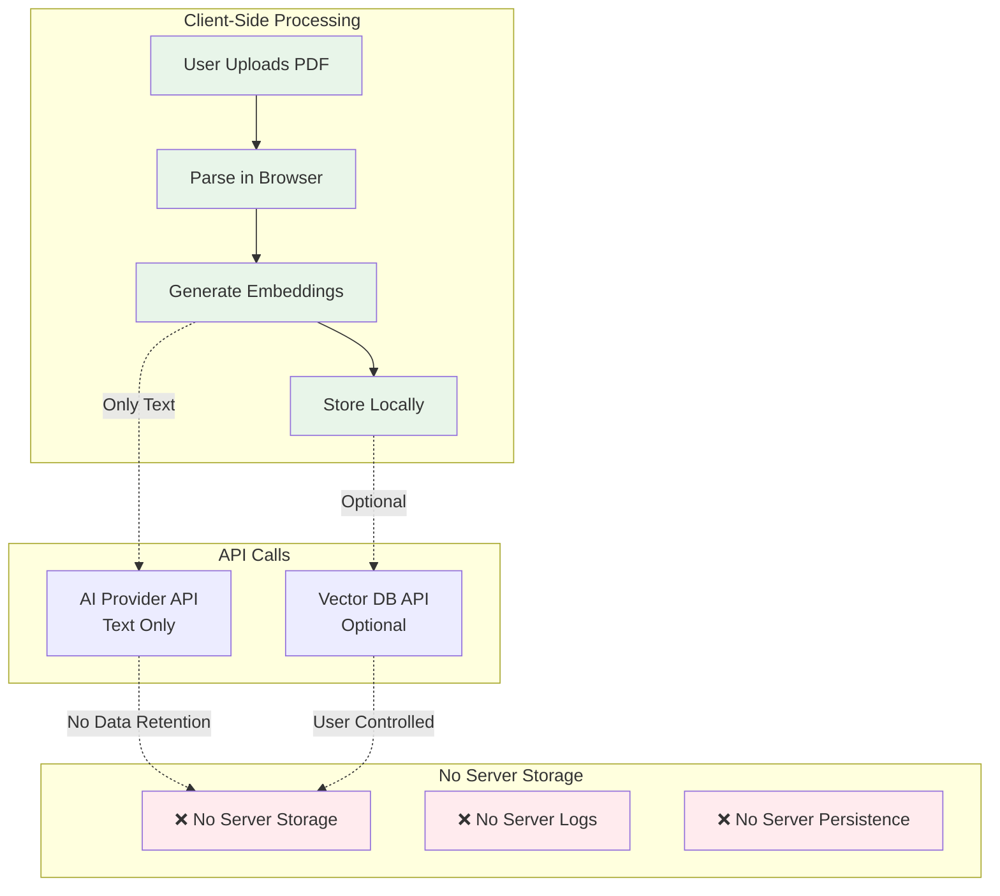
```mermaid
graph TB
    subgraph "Client-Side Processing"
        UPLOAD[User Uploads PDF]
        PARSE[Parse in Browser]
        EMBED[Generate Embeddings]
        STORE[Store Locally]
    end

    subgraph "API Calls"
        AI_API[AI Provider API<br/>Text Only]
        VDB_API[Vector DB API<br/>Optional]
    end

    subgraph "No Server Storage"
        NO_SERVER[❌ No Server Storage]
        NO_LOGS[❌ No Server Logs]
        NO_PERSIST[❌ No Server Persistence]
    end

    UPLOAD --> PARSE
    PARSE --> EMBED

    EMBED -.->|Only Text| AI_API
    EMBED --> STORE

    STORE -.->|Optional| VDB_API

    AI_API -.->|No Data Retention| NO_SERVER
    VDB_API -.->|User Controlled| NO_SERVER

    style UPLOAD fill:#e8f5e9
    style PARSE fill:#e8f5e9
    style EMBED fill:#e8f5e9
    style STORE fill:#e8f5e9
    style NO_SERVER fill:#ffebee
    style NO_LOGS fill:#ffebee
    style NO_PERSIST fill:#ffebee
```

---

## Deployment Architecture

### Production Deployment

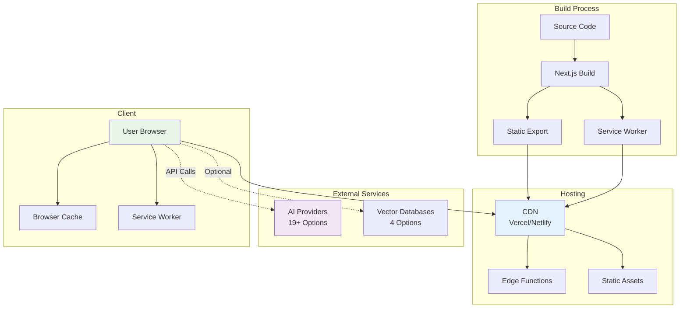
```mermaid
graph TB
    subgraph "Build Process"
        SRC[Source Code]
        BUILD[Next.js Build]
        STATIC[Static Export]
        SW[Service Worker]
    end

    subgraph "Hosting"
        CDN[CDN<br/>Vercel/Netlify]
        EDGE[Edge Functions]
        ASSETS[Static Assets]
    end

    subgraph "External Services"
        AI_PROVIDERS[AI Providers<br/>19+ Options]
        VECTOR_DBS[Vector Databases<br/>4 Options]
    end

    subgraph "Client"
        BROWSER[User Browser]
        CACHE[Browser Cache]
        SW_CLIENT[Service Worker]
    end

    SRC --> BUILD
    BUILD --> STATIC
    BUILD --> SW

    STATIC --> CDN
    SW --> CDN
    CDN --> EDGE
    CDN --> ASSETS

    BROWSER --> CDN
    BROWSER --> CACHE
    BROWSER --> SW_CLIENT

    BROWSER -.->|API Calls| AI_PROVIDERS
    BROWSER -.->|Optional| VECTOR_DBS

    style CDN fill:#e3f2fd
    style BROWSER fill:#e8f5e9
    style AI_PROVIDERS fill:#f3e5f5
```

---

## Summary

This document provides comprehensive visual representations of:

1. **System Architecture** - Overall structure and technology stack
2. **Core Components** - RAG engine, AI client, and their interactions
3. **Data Flows** - Document processing, query handling, and vector search
4. **Component Interactions** - React component hierarchy and state management
5. **Processing Pipelines** - PDF extraction, chunking, embedding generation
6. **State Management** - Zustand store structure and message flow
7. **Performance** - Caching strategies and fallback mechanisms
8. **Security** - Privacy-focused architecture
9. **Deployment** - Production deployment architecture

These diagrams serve as a visual guide to understanding the complex interactions within the QuantumPDF ChatApp system.

---

**Last Updated**: 2025-10-13
**Version**: 1.0.0
**Purpose**: Comprehensive architecture visualization
