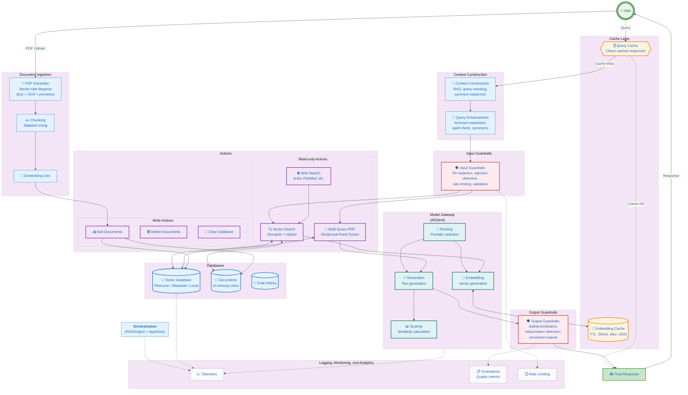

# QuantumPDF Chat App - System Architecture

---

## ✅ NEWLY IMPLEMENTED Components (Dec 2024)

| Component | Location | Description |
|-----------|----------|-------------|
| **Query Response Cache** | `lib/query-processor.ts` | Full query→response caching with 30min TTL, LRU eviction, document-aware invalidation |
| **LLM Query Rewriting** | `lib/query-processor.ts` | AI-powered query reformulation for better retrieval |
| **HyDE** | `lib/query-processor.ts` | Hypothetical Document Embeddings - generates ideal answer for semantic search |
| **Step-back Prompting** | `lib/query-processor.ts` | Generates broader questions for complex queries to get foundational context |
| **Query Classification** | `lib/query-processor.ts` | Classifies queries (factual, analytical, comparative, etc.) for optimal processing |
| **Cache Invalidation** | `lib/rag-engine.ts` | Automatic cache invalidation when documents are added/removed |

---

## ⚠️ REMAINING Gaps

| Component | Status | Notes |
|-----------|--------|-------|
| **Write Actions** | ⚠️ Limited | Only document add/delete, no external writes (emails, etc.) |
| **Model Routing** | ⚠️ Basic | Provider switching exists, no cost/latency-based intelligent routing |
| **Streaming Cache** | ❌ Missing | Cached responses don't support streaming |

---

## ✅ PREVIOUSLY IMPLEMENTED Components

| Component | Location | Description |
|-----------|----------|-------------|
| **Embedding Cache** | `lib/ai-client.ts:59-137` | LRU cache with 30min TTL, max 1000 entries |
| **Input Guardrails** | `lib/guardrails.ts:33-86` | Query validation, injection detection, PII check |
| **Output Guardrails** | `lib/guardrails.ts:205-273` | Toxicity scoring, hallucination detection |
| **Rate Limiting** | `lib/guardrails.ts:276-346` | Per-session rate limiting |
| **Query Enhancement** | `api/search/unified/route.ts:449-534` | Acronym expansion, synonyms, spell check |
| **Multi-Query RRF** | `lib/rag-engine.ts` | Reciprocal Rank Fusion for retrieval |
| **Evaluation Metrics** | `lib/guardrails.ts:348-619` | Retrieval & generation quality metrics |
| **Telemetry** | `lib/telemetry.ts` | Document tracking, query logging |

---

## Key Components

1. **User Interface**
   - Chat Interface: Handles user interactions and displays responses
   - Document Library: Manages uploaded PDFs and documents
   - Configuration Panel: For system settings and preferences

2. **API Layer**
   - Search Handler: Processes search queries and returns results
   - Vector DB Handler: Manages vector database operations
   - PDF Extraction (`/api/pdf/extract`): Server-side text, OCR, and page-preview extraction via `@llamaindex/liteparse` (native Rust + PDFium), with a PDF.js text fallback

3. **Core Services**
   - RAG Engine: Orchestrates the retrieval-augmented generation process
   - AI Client: Interfaces with language models for text generation
   - Vector DB Client: Handles vector storage and retrieval
   - Document Store: Manages document metadata and content

4. **External Services**
   - Vector Database: Pinecone/Weaviate for similarity search
   - AI Models: HuggingFace/OpenAI for embeddings and text generation
   - Local Storage: For document persistence

## Data Flow

1. **Document Ingestion**
   - User uploads PDF → `lib/pdf-document-processor.ts` POSTs the file to the server-side liteparse route (`/api/pdf/extract`) for text/OCR/previews, then runs the client-side PDF.js extractors for embedded images, tables, and equations → Text is chunked → Chunks are embedded → Stored in Vector DB

2. **Query Processing**
   - User submits query → Query is embedded → Similar chunks retrieved → Context sent to LLM → Response returned to user

3. **Context Management**
   - System maintains conversation history and document context
   - Vector DB enables semantic search across all processed documents